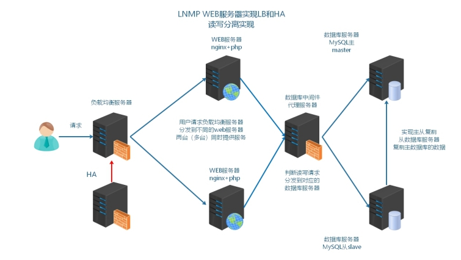
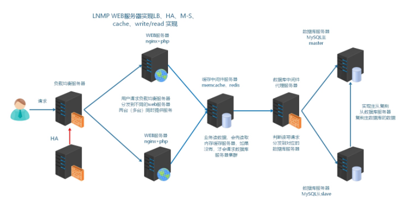
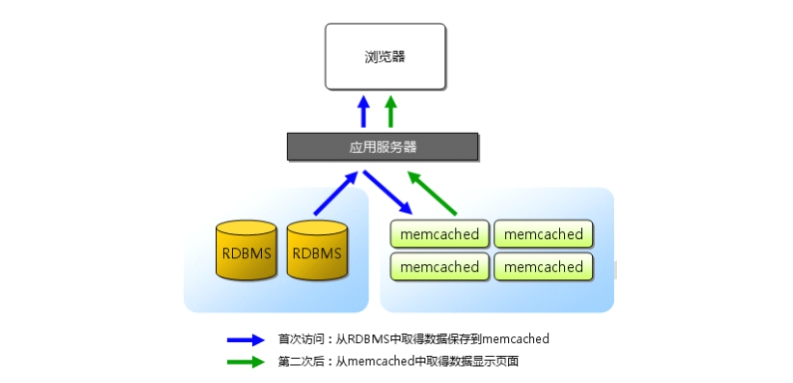
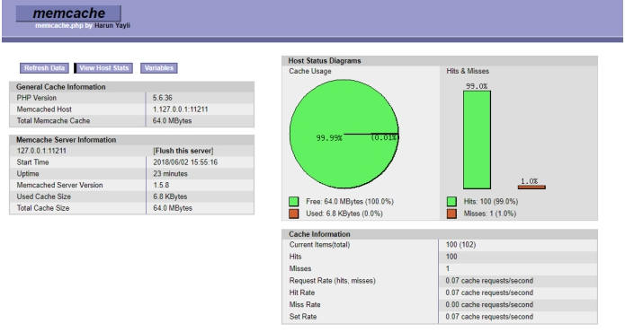
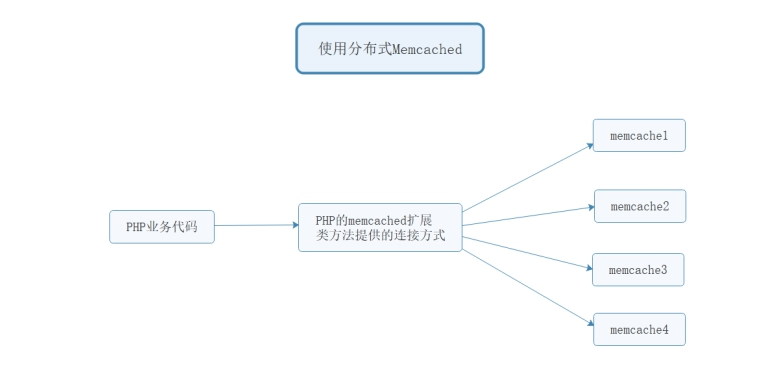

# 企业级架构缓存篇之memcached

# 学习目标

1、能够理解描述网站业务访问流程

2、能够理解网站业务的优化方向

3、能够描述内存缓存软件memcached的作用

4、能够通过命令行操作memcached

5、能够操作安装php的memcached扩展 extension

6、能够实现session存储到memcached的案例

7、能够实现启动memcached多实例

# 一、背景描述及方案设计

## 1、业务背景

时间：2016.6 - 2016.9

发布产品类型：互联动态站点=>商城

用户数量： 20000（用户量猛增）

PV ： 1000000-5000000（24小时访问次数总和）

DAU： 8000~10000（每日活跃用户数）

## 2、项目架构图



## 3、运行流程

LNMP架构中网站应用访问流程

> 浏览器（app）=>web服务器=>后端服务（php)=>数据库（mysql）

访问流程越多，访问速度和出现问题的几率也越大

优化访问速度，就需要减少访问步骤或者提高单步骤的速度

## 4、优化思路

根据网页的访问流程，可以进行以下优化：

① 提高web   服务器并发  负载均衡（多台服务器架构） nginx

② 页面静态化  把经常访问，但是数据不经常发生变动的动态页面，制作为静态页面 （varnish squid  nginx）.php => php解析器 => 操作mysql数据库 => 返回给nginx

③ 内存缓存优化   把经常访问的数据，加载到内存中使用

④ 数据库优化   很多时候，还需要取数据库信息，所以优化数据库本身

## 5、解决方案

随着业务量增加，访问量越来越大，用户在访问某些页面数据时，通过慢查询日志发现慢查询SQL，经过优化之后效果还是不够明显。而此类数据发生变动的频率又较小，故提出使用缓存中间件（一般会将数据存储到内存中）的方式，降低MySQL的读压力，提高整个业务架构集群的稳定和快速响应能力

在dsshop商城业务中，在两个点使用：

① 首页栏目项加载

② 负载均衡后，web服务器间session共享的问题

根据以上业务需求和方案，服务器架构升级为如下示意图：memcached/redis



 LNMP架构：

传统访问流程：用户=>Nginx=>PHP（Web服务器）=>MySQL=>PHP=>Nginx=>用户

高级缓存流程：引入memcached/redis

==用户=>Nginx=>PHP=>内存(memcached/redis)判断我们查询的数据有没有缓存，如果有返回给PHP=>Nginx=>用户。==

# 二、内存缓存memcached

## 1、memcached概述

官方网址：<http://memcached.org/>

memory  cache   =>   cache   in   memory   缓存放入内存中

memcached 是国外社区网站 LiveJournal  的开发团队开发的高性能的分布式内存缓存服务器。一般的使用目的：==通过缓存数据库查询结果，减少数据库访问次数，以提高动态 Web 应用的速度、提高可扩展性。==




## 2、安装memcached

第一步：上次memcache到Linux操作系统

```powershell
memcached-1.5.8.tar.gz
```

第二步：配置=>编译=>安装

```powershell
shell > tar xvf memcached-1.5.8.tar.gz
shell > cd memcached-1.5.8
shell > ./configure --prefix=/usr/local/memcached
shell > make && make install
```

依赖问题：

```powershell
error:libevent is required ...
```

解决方案1：使用yum安装libevent(挂载光盘)

```powershell
# yum -y install libevent-devel
```

解决方案2：下载libevent编译包，编译安装

```powershell
# ./configure --prefix=/usr/local/libevent && make && make install
```

第三步：重新编译安装memcached

```powershell
# ./configure --prefix=/usr/local/memcached --with-libevent=/usr/local/libevent
```

## 3、安装目录介绍

```powershell
# bin     :  memcached二进制程序目录
# include :  依赖库文件
# share   :  man手册
```

## 4、memcached求帮助

```powershell
# bin/memcached -h

-p 设置memcached监听的端口，最好是1024以上的端口。默认为11211
-d 启动一个守护进程deamon（后台运行）
-m 分配给memcached使用的内存数量，单位是MB，默认为64M
-u 运行memcached的用户
-l 监听服务器IP地址，可以有多个地址
-c 最大运行的并发连接数，默认是1024
-P 设置保存memcached的pid文件
```

## 5、启动memcached

```powershell
# ./memcached -uroot -d
# ps -ef |grep memcached
```

# 三、telnet连接memcached

## 1、telnet概述

Telnet协议是TCP/IP协议族中的一员，是Internet远程登录服务的标准协议和主要方式。它为用户提供了在本地计算机上完成远程主机工作的能力。

## 2、安装telnet

```powershell
# yum -y install telnet
```

## 3、连接memcached

```powershell
# telnet 127.0.0.1 11211
多敲几次回车，看到ERROR代表连接成功...

ERROR:主要为memcached服务器对于空命令的报错
```

## 4、退出telnet

```powershell
# quit命令
```

# 四、memcached相关命令

memcached存储结构：key:value结构，key代表键，value代表值

name:'itcast'

age:18

address:'beijing'

## 1、set设置命令

语法：set

```powershell
# set key flag exptime bytes
参数解析：
flag  服务端提供的一个标识，默认没什么意义，默认可以传个0，这个标识为编程语言一个状态，例如:flag（0,1） 代表是否采用压缩机制 => 0代表不压缩，1代表压缩
bytes 字节数，1kb = 1024b

聊聊一个字符与中文字节所占用的字节数：
字符  纯英文和数字，一个字符代表一个字节  abc=>3个字节  abc123=>6个字节
汉字  与字符编码格式有关，GBK一个字符占用2个字节，UTF-8一个字符占用3个字节
```

set 命令用于将 value(数据值) 存储在指定的 key(键) 中

如果set的key已经存在，该命令可以更新该key所对应的原来的数据，也就是实现更新的作用

案例：存储devops到name中

```powershell
# set name 0 0 6
devops
STORED => 存储成功
```

## 2、add添加命令

add 命令用于将 value(数据值) 存储在指定的 key(键) 中

如果 add 的 key 已经存在，则不会更新（注：数据过期的 key 会更新)，之前的值将仍然保持相同，并且您将获得响应 NOT_STORED

基本语法：

```powershell
# add key flag exptime bytes
# values 
```

## 3、replace修改命令

语法：replace

replace 命令用于替换已存在的 key(键) 的 value(数据值)

如果 key不存在，则替换失败，并且您将获得响应 NOT_STORED

```powershell
# replace key flag exptime bytes
# value
```

## 4、append追加命令

append 命令用于向已存在 key(键) 的 value(数据值) 尾部追加数据

```powershell
# append key flag exptime bytes
# value
```

## 5、prepend前置命令

prepend 命令用于向已存在 key(键) 的 value(数据值) 前面追加数据

```powershell
# prepend key flag exptime bytes
# value
```

## 6、delete删除命令

delete 命令用于删除已存在的key

```powershell
# delete key
```

## 7、flush_all清空命令（慎用）

flush_all 命令用于清理缓存中的所有 key=>value(键=>值) 对

该命令提供了一个可选参数 time，用于在指定的时间后执行清理缓存操作

```powershell
# flush_all [time]
```

## 8、查找与计算命令

语法：get

get 命令获取存储在 key(键) 中的 value(数据值) ，如果 key 不存在，则返回空

```powershell
# get key1 key2 key3
```

语法：incr(相加) / decr(相减)

计数器，默认执行+1或-1操作

incr 与 decr 命令用于对已存在的 key(键) 的数字值进行自增或自减操作

incr 与 decr 命令操作的数据必须是十进制的32位无符号整数

```powershell
# incr key value
# decr key value
```

## 9、stats统计命令

```powershell
pid：memcached服务器进程ID
uptime：服务器已运行秒数
time：服务器当前Unix时间戳
time-uptime：启动时间
version：memcached版本
pointer_size：操作系统指针大小
rusage_user：进程累计用户时间
rusage_system：进程累计系统时间
curr_connections：当前连接数量
total_connections：memcached运行以来连接总数
connection_structures：memcached分配的连接结构数量
cmd_get：get命令请求次数	=>  重要
cmd_set：set命令请求次数	=>  重要
cmd_flush：flush命令请求次数
get_hits：get命令命中次数	=> get命中的次数
get_misses：get命令未命中次数	=> get未命中的次数
delete_misses：delete命令未命中次数
delete_hits：delete命令命中次数
incr_misses：incr命令未命中次数
incr_hits：incr命令命中次数
decr_misses：decr命令未命中次数
decr_hits：decr命令命中次数
cas_misses：cas命令未命中次数
cas_hits：cas命令命中次数
cas_badval：使用擦拭次数
auth_cmds：认证命令处理的次数
auth_errors：认证失败数目
bytes_read：读取总字节数
bytes_written：发送总字节数
limit_maxbytes：分配的内存总大小（字节）
accepting_conns：服务器是否达到过最大连接（0/1）
listen_disabled_num：失效的监听数
threads：当前线程数
conn_yields：连接操作主动放弃数目
bytes：当前存储占用的字节数
curr_items：当前存储的数据总数
total_items：启动以来存储的数据总数
evictions：LRU释放的对象数目
reclaimed：已过期的数据条目来存储新数据的数目
```

==**缓存命中率**：命中数（get获取到数据）/ 获取次数（get的次数）==

get_hits/cmd_get,如果命中率低，业务代码缓存有问题，命中率为0，缓存没有起作用

缓存穿透  数据访问经过缓存，没有获取到数据，再直接访问数据库

缓存雪崩  数据查询全部没有命中，直接访问数据库，数据压力上升

解决方案：

① 尽量及时缓存数据库中的更新数据（新数据）

② 缓存的失效时间，尽量分布开，同步缓存的数据时间点是平均的，就不会同时请求数据库做缓存，造成数据库压力太大

## 10、memcached注意事项

☆ memcached最大过期时间?  

答：如不注意这个细节,过期时间设置大于了**30天（30x24x60x60=2592000），超过后，其值无法设置进缓存**

☆ memcached单个key最大长度？ 

答：memcached的key的**最大长度是250个字符**，是memcached服务端的限制

☆ memcached单个item最大能存储？

答：**1M，要增加的话，启动时添加-I（i大写） 10m参数就可以**，但是后期插入超过1M值会提示警告

# 五、PHP安装memcached扩展

## 1、为什么要安装扩展

为了LNMP架构中，可以使用memcached缓存，业务代码为php，需要安装php的扩展，来实现php操作memcached extension。


## 2、安装PHP memcached扩展

第一步：上传软件到Linux系统中（web01与web02=>web服务器，需要php的支持phpize）

```powershell
memcached-3.1.3.tgz 		    PHP memcached扩展
libmemcached-1.0.18.tar.gz      PHP memcached扩展的依赖
```

第二步：解压缩、配置与编译安装

注：PHP扩展编译安装，需要使用到phpize和php-config，把php的bin目录配置到PATH中，如果没有配置，可以按照如下配置到/etc/profile，注意生效重载source /etc/profile

```powershell
shell > tar xvf memcached-3.1.3.tgz
shell > cd memcached-3.1.3
#扩展源码包和php关联生成configure文件
shell > phpize
#执行看依赖
shell > ./configure
```

有一个依赖需要解决，安装libmemcached，而且要求版本在1.x以上

```powershell
shell > tar xvf libmemcached-1.0.18.tar.gz
shell > cd libmemcached-1.0.18
shell > ./configure --prefix=/usr/local/libmemcached && make && make install

shell > cd /root/memcached-3.1.3
shell > ./configure --with-libmemcached-dir=/usr/local/libmemcached --disable-memcached-sasl
shell > make && make install
```

查看是否安装成功：

```powershell
# ls /usr/local/php/lib/php/extensions/no-debug-zts-20170718/
# memcached.so
```

第三步：在php.ini添加memcached.so扩展

```powershell
shell > vim /usr/local/php/etc/php.ini
添加一行：
909行 extension=memcached.so
```

第四步：重启php-fpm服务

```powershell
shell > service php-fpm restart
```

第五步：编译demo.php，显示php信息

在页面访问目录写一个php文件，里面写代码phpinfo()，用来检测php相关参数状态

## 3、编写php测试代码（了解）

```powershell
<?php
	$mem = new Memcached();
	$mem->addServer('Memcached服务器地址',11211);
	$mem->set('name','itheima');
	var_dump($mem->get('name'));
```

# 六、memcached小工具

## 1、小工具能干啥

查看memcached运行状态、key(item)多少了、内存使用多少了

## 2、memcache_tools.php

上传到/home/www/public目录

查看默认用户名与密码与登录地址：

```powershell
22行 ADMIN_USERNAME root
23行 ADMIN_PASSWORD 123456
28行 $MEMCACHE_SERVERS[] = 'Memcached服务器地址:11211'
```

## 3、运行结果

 

# 七、失效机制（了解）

**① 如果key过期了，value会及时删除么，空间会及时清空么？**

**② 如果分配的存储空间，写满了，还允许写么?**

## 1、Lazy Expiration

memcached1.4.25之后 就不是懒惰机制了。

memcached 内部不会监视记录是否过期，而是在 get时查看记录的时间戳，检查记录是否过期。这种技术被称为 lazy（惰性）expiration。因此，memcached 不会在过期监视上耗费 CPU 时间

比如php的里session机制 懒惰机制 php垃圾回收机制 gc回收  python 变量垃圾回收机制

## 2、LRU

memcached 会优先使用已超时的记录的空间，但即使如此，也会发生追加新记录时空间不足的情况，此时就要使用名为 Least Recently Used（LRU）机制来分配空间。顾名思义，这是删除“最近最少使用”的记录的机制。因此，当 memcached 的内存空间不足时，就从最近未被使用的记录中搜索，并将其空间分配给新的记录。从缓存的实用角度来看，该模型十分理想。

不过，有些情况下 LRU 机制反倒会造成麻烦。memcached 启动时通过“­M”参数可以禁止 LRU

# 八、Session入Memcached共享

## 1、为什么需要session入库

使用分布式架构，负载均衡之后，请求会被分发到不同的服务器，登录或者验证码需要获取存储的session值，如果每次都随机的分配到不同web服务器，就不能够获取到session（生成在web1，校验在web2）

解决：

① ip_hash  同IP用户访问同一个web服务器(lvs=>sh静态调度算法，haproxy=>source)

② 通过session共享的方式   入mysql  memcached  redis（内存存储，最优）

session入库共享的好处：

① 负载均衡各web服务器间，能够共享使用session

② session是比较小数据，默认存储到服务器文件中，如果文件变多，遍历比较慢。返回速度较慢。

③ 解决sso单点登录问题

登录状态持续

[www.baidu.com](http://www.baidu.com)

[pan.baidu.com](pan.baidu.com)

[music.baidu.com](music.baidu.com)

[image.baidu.com](image.baidu.com)

## 2、DSShop商城实现session入库（框架）

```powershell
# vim /home/www/application/config.php
202     'session' => [
203         'id' => '',
204         // SESSION_ID的提交变量,解决flash上传跨>    域
205         'var_session_id' => '',
206         // SESSION 前缀
207         'prefix' => 'think',
208         // 驱动方式 支持redis memcache memcached
209         'type' => 'memcached',
210		    // Memcached服务器地址
211		    'host' => '10.1.1.20',			
212         // 是否自动开启 SESSION
213         'auto_start' => true,
214     ],

# vim /home/www/application/home或admin/config.php
10     'session' => [
11         'id' => '',
12         // SESSION_ID的提交变量,解决flash上传跨>    域
13         'var_session_id' => '',
14         // SESSION 前缀
15         'prefix' => 'home',
16         // 驱动方式 支持redis memcache memcached
17         'type' => 'memcached',
18		   // Memcached服务器地址
19		   'host' => '10.1.1.20',
20         // 是否自动开启 SESSION
21         'auto_start' => true,
22     ],
23 ];
```

# 九、单机多实例memcached

## 1、单机多实例实现原理



使用单机多实例必须有一个前提：每个memcached应该有单独的端口号。

## 2、单机多实例实现

```powershell
# /usr/local/memcached/bin/memcached -uroot -d -p 11212
# /usr/local/memcached/bin/memcached -uroot -d -p 11213
# /usr/local/memcached/bin/memcached -uroot -d -p 11214

# ps -ef |grep memcached --color=auto
```

