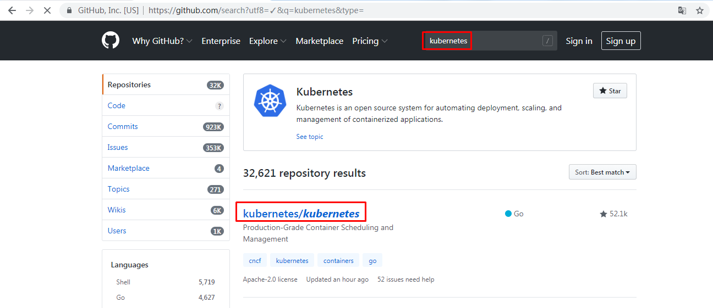
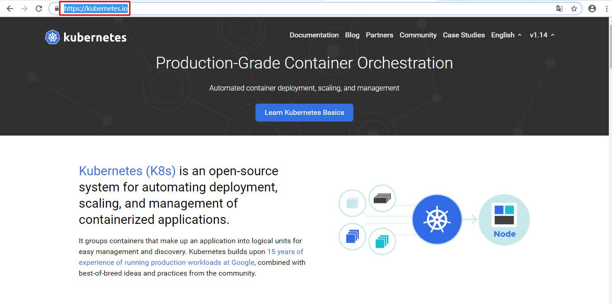
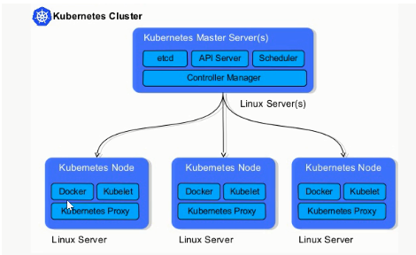
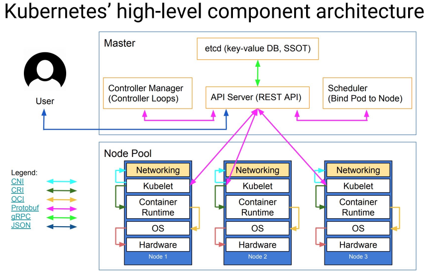
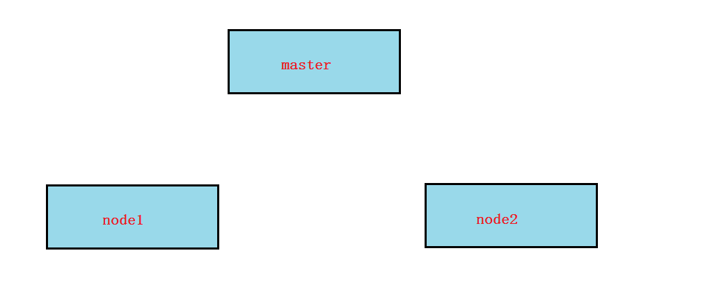

# kubernetes

# 一、认识容器编排

- docker machine
- docker compose
- docker swarm
  - docker service
  - docker stack

- kubernetes
- mesos+marathon

# 二、PaaS平台

- OpenShift
- Rancher

# 三、认识kubernetes

官方网址

https://kubernetes.io/

https://kubernetes.io/zh/

中文社区

http://docs.kubernetes.org.cn/

希腊语：舵手、飞行员

来自于谷歌Borg

使用golang语言开发

简称为k8s

现归属于CNCF
- 云原生计算基金会

- 是一个开源软件基金会，致力于使云计算普遍性和持续性

- 官方：http://www.cncf.io

  

**kubernetes版本**

- 2014年9月第一个正式版本
- 2015年7月1.0版本正式发布
- 现在稳定版本为1.15
- 主要贡献者：Google,Redhat,Microsoft,IBM,Intel
- 代码托管github:<https://github.com/kubernetes/>

- 节点数支持
  - 100台
  - 现在可以支持5000台

- pod管理支持
  - 原先管理1000
  - 现管理150000

**用户**

- 2017年docker官方宣布原生支持kubernetes
- RedHat公司  PaaS平台  OpenShift核心是kubernetes
- Rancher平台核心是kubernetes
- 现国内大多数公司都可使用kubernetes进行传统IT服务转换，以实现高效管理等。

# 四、kubernetes架构

kubernetes是具有中心节点的架构,也就是说有master管理节点

节点角色

- Master Node   manager
- Minion Node   worker

**简单叫法**

Master

Node

## 架构图示

## Master节点组件介绍

master节点是集群管理中心，它的组件可以在集群内任意节点运行，但是为了方便管理所以会在一台主机上运行Master所有组件，**并且不在此主机上运行用户容器**

Master组件包括：
- kube-scheduler 
  
  监视新创建没有分配到Node的Pod，为Pod选择一个Node
  
- kube-apiserver
  
  用于暴露kubernetes API，任何的资源请求/调用操作都是通过kube-apiserver提供的接口进行
  
- ETCD
  
  是kubernetes提供默认的存储系统，保存所有集群数据，使用时需要为etcd数据提供备份计划
  
- kube-controller-manager
  
  运行管理控制器，它们是集群中处理常规任务的后台线程
  
  

## Node节点组件介绍

node节点用于运行以及维护Pod,提供kubernetes运行时环境

Node组件包括：
- kubelet 
  - 负责维护容器的生命周期(创建pod，销毁pod)，同时也负责Volume(CVI)和网络(CNI)的管理
- kube-proxy 
  - 通过在主机上维护网络规则并执行连接转发来实现service(Iptables/Ipvs)
  - 随时与API通信，把Service或Pod改变提交给API（不存储在Master本地，需要保存至共享存储上），保存至etcd（可做高可用集群）中，负责service实现，从内部pod至service和从外部node到service访问。
- docker
  - 容器运行时(Container Runtime)
  - 负责镜像管理以及Pod和容器的真正运行
  - 支持docker/Rkt/Pouch/Kata等多种运行时,但我们这里只使用docker

## Add-ons介绍

Add-ons(附件)使功能更丰富，没它并不影响实际使用，可以与主体程序很好结合起来使用

- coredns/kube-dns 负责为整个集群提供DNS服务
- Ingress Controller 为服务提供集群外部访问
- Heapster/Metries-server 提供集群资源监控(监控容器可以使用prometheus)
- Dashboard 提供GUI
- Federation 提供跨可用区的集群
- Fluentd-elasticsearch 提供集群日志采集、存储与查询

# 五、集群部署方式

**kubeadm介绍**

- 安装软件 kubelet kube-proxy kubeadm kubectl
- 初始化集群
- 添加node到集群中
- 证书自动生成
- 集群管理系统是以容器方式存在，容器运行在master
- 容器镜像是谷歌提供
  
  

了解其它部署方式:

minikube  单机简化安装

kubeasz  支持多主  参考: https://github.com/easzlab/kubeasz

# 六、kubeadm部署kubernetes集群

## 准备环境

三台2G+内存4核CPU的centos7.6, 单网卡

1, **所有节点**主机名及绑定

~~~powershell
127.0.0.1   localhost localhost.localdomain localhost4 localhost4.localdomain4
::1         localhost localhost.localdomain localhost6 localhost6.localdomain6
192.168.122.1   daniel.cluster.com
192.168.122.11  master
192.168.122.12  node1
192.168.122.13  node2
~~~

2, **所有节点**关闭selinux

3, **所有节点**关闭firewalld,安装iptables服务,并保存为空规则

~~~powershell
# systemctl stop firewalld
# systemctl disable firewalld

# yum install iptables-services -y
# systemctl restart iptables
# systemctl enable iptables

# iptables -F
# iptables -F -t nat
# iptables -F -t mangle
# iptables -F -t raw

# iptables -L
Chain INPUT (policy ACCEPT)
target     prot opt source               destination

Chain FORWARD (policy ACCEPT)
target     prot opt source               destination

Chain OUTPUT (policy ACCEPT)
target     prot opt source               destination

# service iptables save
iptables: Saving firewall rules to /etc/sysconfig/iptables:[  OK  ]
~~~

3, **所有节点**时间同步

4, **所有节点**准备yum源(在centos默认源的基础上再加上以下两个yum源)

~~~powershell
# vim /etc/yum.repos.d/kubernetes.repo
[k8s]
name=k8s
baseurl=https://mirrors.aliyun.com/kubernetes/yum/repos/kubernetes-el7-x86_64/
enabled=1
gpgcheck=0
~~~

~~~powershell
# wget https://mirrors.aliyun.com/docker-ce/linux/centos/docker-ce.repo -O /etc/yum.repos.d/docker-ce.repo
~~~

5, **所有节点**关闭swap(kubernetes1.8开始不关闭swap无法启动)

~~~powershell
# swapoff -a

打开fstab文件将swap那一行注释保存
# vim /etc/fstab
UUID=38182b36-9be4-45f8-9b3f-f9b3605fcdf0 /                       xfs     defaults        0 0
UUID=6b69e04f-4a85-4612-b1c0-24939fd84962 /boot                   xfs     defaults        0 0
#UUID=9ba6a188-d8e1-4983-9abe-ba4a29b1d138 swap                    swap    defaults        0 0
~~~

6, RHEL7和CentOS7有由于iptables被绕过而导致流量路由不正确的问题,需要**所有节点**做如下操作: 

~~~powershell
# cat > /etc/sysctl.d/k8s.conf <<EOF
net.ipv4.ip_forward = 1
vm.swappiness = 0
net.bridge.bridge-nf-call-ip6tables = 1
net.bridge.bridge-nf-call-iptables = 1
EOF

# sysctl -p /etc/sysctl.d/k8s.conf
# modprobe br_netfilter
# lsmod |grep br_netfilter
~~~

7, **所有节点**设置kube-proxy开启ipvs的前置条件

由于ipvs已经加入到了内核的主干，所以为kube-proxy开启ipvs的前提需要加载以下的内核模块

~~~powershell
# cat > /etc/sysconfig/modules/ipvs.modules <<EOF
modprobe ip_vs
modprobe ip_vs_rr
modprobe ip_vs_wrr
modprobe ip_vs_sh
modprobe nf_conntrack_ipv4
EOF

# chmod 755 /etc/sysconfig/modules/ipvs.modules
# sh /etc/sysconfig/modules/ipvs.modules
# lsmod |egrep 'ip_vs|nf_conntrack'
~~~

## 安装软件

1, **所有节点**安装docker, **==一定要注意docker版本，docker最新版本kubernetes不一定支持==**,下面就是使用最新19.03.01跑docker在集群始化时报的错.所以在这里我们使用18.09的版本

~~~powershell
# yum list docker-ce.x86_64 --showduplicates | sort -r

# yum install docker-ce-18.09.8-3.el7 docker-ce-cli-18.09.8-3.el7 --setopt=obsoletes=0 -y

# docker -v
Docker version 18.09.8, build 0dd43dd87f

# systemctl start docker
# systemctl enable docker
~~~

2, 所有节点配置加速器和将cgroupdrivier改为systemd,并重启docker服务

~~~powershell
# vim /etc/docker/daemon.json
{
   "registry-mirrors": ["https://42h8kzrh.mirror.aliyuncs.com"],
   "exec-opts": ["native.cgroupdriver=systemd"]
}

# systemctl restart docker
~~~

3, **所有节点**安装kubelet,kubeadm,kubectl.并`enable kubelet`服务(**注意: 不要start启动**)

~~~powershell
# yum install kubelet-1.15.1-0 kubeadm-1.15.1-0 kubectl-1.15.1-0 -y
# systemctl enable kubelet
~~~

> Kubelet负责与其他节点集群通信，并进行本节点Pod和容器的管理。

> Kubeadm是Kubernetes的自动化部署工具，降低了部署难度，提高效率。

> Kubectl是Kubernetes集群管理工具。

## kubeadm初始化

在master节点上操作(**其它节点不操作**)

**==注意: 初始化的过程中需要下载1G大小左右的镜像,所以可以提前将我在笔记里准备好的镜像分别在master和node节点上使用docker load导入==**

~~~powershell
[root@master ~]# kubeadm init --kubernetes-version=1.15.1 --apiserver-advertise-address=192.168.122.11 --image-repository registry.aliyuncs.com/google_containers --service-cidr=10.2.0.0/16 --pod-network-cidr=10.3.0.0/16

[init] Using Kubernetes version: v1.15.1
[preflight] Running pre-flight checks
[preflight] Pulling images required for setting up a Kubernetes cluster
[preflight] This might take a minute or two, depending on the speed of your internet connection
[preflight] You can also perform this action in beforehand using 'kubeadm config images pull'
[kubelet-start] Writing kubelet environment file with flags to file "/var/lib/kubelet/kubeadm-flags.env"
[kubelet-start] Writing kubelet configuration to file "/var/lib/kubelet/config.yaml"
[kubelet-start] Activating the kubelet service
[certs] Using certificateDir folder "/etc/kubernetes/pki"
[certs] Generating "ca" certificate and key
[certs] Generating "apiserver" certificate and key
[certs] apiserver serving cert is signed for DNS names [master kubernetes kubernetes.default kuberne                    tes.default.svc kubernetes.default.svc.cluster.local] and IPs [10.2.0.1 192.168.122.11]
[certs] Generating "apiserver-kubelet-client" certificate and key
[certs] Generating "front-proxy-ca" certificate and key
[certs] Generating "front-proxy-client" certificate and key
[certs] Generating "etcd/ca" certificate and key
[certs] Generating "etcd/server" certificate and key
[certs] etcd/server serving cert is signed for DNS names [master localhost] and IPs [192.168.122.11 127.0.0.1 ::1]
[certs] Generating "etcd/healthcheck-client" certificate and key
[certs] Generating "etcd/peer" certificate and key
[certs] etcd/peer serving cert is signed for DNS names [master localhost] and IPs [192.168.122.11 127.0.0.1 ::1]
[certs] Generating "apiserver-etcd-client" certificate and key
[certs] Generating "sa" key and public key
[kubeconfig] Using kubeconfig folder "/etc/kubernetes"
[kubeconfig] Writing "admin.conf" kubeconfig file
[kubeconfig] Writing "kubelet.conf" kubeconfig file
[kubeconfig] Writing "controller-manager.conf" kubeconfig file
[kubeconfig] Writing "scheduler.conf" kubeconfig file
[control-plane] Using manifest folder "/etc/kubernetes/manifests"
[control-plane] Creating static Pod manifest for "kube-apiserver"
[control-plane] Creating static Pod manifest for "kube-controller-manager"
[control-plane] Creating static Pod manifest for "kube-scheduler"
[etcd] Creating static Pod manifest for local etcd in "/etc/kubernetes/manifests"
[wait-control-plane] Waiting for the kubelet to boot up the control plane as static Pods from directory "/etc/kubernetes/manifests". This can take up to 4m0s
[apiclient] All control plane components are healthy after 25.503078 seconds
[upload-config] Storing the configuration used in ConfigMap "kubeadm-config" in the "kube-system" Namespace
[kubelet] Creating a ConfigMap "kubelet-config-1.15" in namespace kube-system with the configurationfor the kubelets in the cluster
[upload-certs] Skipping phase. Please see --upload-certs
[mark-control-plane] Marking the node master as control-plane by adding the label "node-role.kubernetes.io/master=''"
[mark-control-plane] Marking the node master as control-plane by adding the taints [node-role.kubernetes.io/master:NoSchedule]
[bootstrap-token] Using token: cyoesa.wyuw7x30j0hqu7sr
[bootstrap-token] Configuring bootstrap tokens, cluster-info ConfigMap, RBAC Roles
[bootstrap-token] configured RBAC rules to allow Node Bootstrap tokens to post CSRs in order for nodes to get long term certificate credentials
[bootstrap-token] configured RBAC rules to allow the csrapprover controller automatically approve CSRs from a Node Bootstrap Token
[bootstrap-token] configured RBAC rules to allow certificate rotation for all node client certificates in the cluster
[bootstrap-token] Creating the "cluster-info" ConfigMap in the "kube-public" namespace
[addons] Applied essential addon: CoreDNS
[addons] Applied essential addon: kube-proxy

Your Kubernetes control-plane has initialized successfully!

To start using your cluster, you need to run the following as a regular user:

  mkdir -p $HOME/.kube
  sudo cp -i /etc/kubernetes/admin.conf $HOME/.kube/config
  sudo chown $(id -u):$(id -g) $HOME/.kube/config

You should now deploy a pod network to the cluster.
Run "kubectl apply -f [podnetwork].yaml" with one of the options listed at:
  https://kubernetes.io/docs/concepts/cluster-administration/addons/

Then you can join any number of worker nodes by running the following on each as root:

kubeadm join 192.168.122.11:6443 --token cyoesa.wyuw7x30j0hqu7sr \
    --discovery-token-ca-cert-hash sha256:883260472d0cab8c301b99aefcbedf156209a4bf4df1d98466e6bb34c1                    dcfb37

~~~

验证镜像

~~~powershell
[root@master /]# docker images
REPOSITORY                                                        TAG                 IMAGE ID            CREATED             SIZE
registry.aliyuncs.com/google_containers/kube-scheduler            v1.15.1             b0b3c4c404da        2 weeks ago         81.1MB
registry.aliyuncs.com/google_containers/kube-proxy                v1.15.1             89a062da739d        2 weeks ago         82.4MB
registry.aliyuncs.com/google_containers/kube-apiserver            v1.15.1             68c3eb07bfc3        2 weeks ago         207MB
registry.aliyuncs.com/google_containers/kube-controller-manager   v1.15.1             d75082f1d121        2 weeks ago         159MB
registry.aliyuncs.com/google_containers/coredns                   1.3.1               eb516548c180        6 months ago        40.3MB
registry.aliyuncs.com/google_containers/etcd                      3.3.10              2c4adeb21b4f        8 months ago        258MB
registry.aliyuncs.com/google_containers/pause                     3.1                 da86e6ba6ca1        19 months ago       742kB

~~~

### 初始化可能出现的问题

警告:

~~~powershell
[WARNING IsDockerSystemdCheck]: detected "cgroupfs" as the Docker cgroup driver. The recommended driver is "systemd". Please follow the guide at https://kubernetes.io/docs/setup/cri/
~~~

解决: cgroup 驱动建议为systemd

报错:

~~~powershell
[ERROR Swap]: running with swap on is not supported. Please disable swap
[preflight] If you know what you are doing, you can make a check non-fatal with `--ignore-preflight-errors=...`
~~~

解决: kubernetes1.8开始需要关闭swap

## 启动集群

在master节点上操作(**其它节点不操作**)

执行`export KUBECONFIG=/etc/kubernetes/admin.conf`就可以启动集群(加到/etc/profile里实现开机自动启动)

~~~powershell
确认kubelet服务启动了
[root@master ~]# systemctl status kubelet.service

[root@master ~]# vim /etc/profile			
export KUBECONFIG=/etc/kubernetes/admin.conf			# 加到/etc/profile最下面

[root@master ~]# source /etc/profile
~~~

查看集群状态 

~~~powershell
[root@master ~]# kubectl get cs					# cs为componentstatus
NAME                 STATUS    MESSAGE             ERROR
scheduler            Healthy   ok
controller-manager   Healthy   ok
etcd-0               Healthy   {"health":"true"}

[root@master ~]# kubectl get node
NAME              STATUS     ROLES    AGE   VERSION
master            NotReady   master   6m   v1.15.1
~~~

## 创建flannel网络

参考: https://github.com/coreos/flannel

在master节点上操作(**其它节点不操作**)

1,下载kube-flannel.yml(**下载很慢，可以直接使用我共享的kube-flannel.yml文件**)

~~~powershell
[root@master ~]# mkdir /root/k8s
[root@master ~]# cd /root/k8s/
[root@master k8s]# curl -O https://raw.githubusercontent.com/coreos/flannel/master/Documentation/kube-flannel.yml
~~~

2, 应用kube-flannel.yml创建pod(**这一步非常慢,因为要下载镜像,可以使用共享的镜像先导入**)

~~~powershell
[root@master k8s]# kubectl apply -f kube-flannel.yml
podsecuritypolicy.extensions/psp.flannel.unprivileged created
clusterrole.rbac.authorization.k8s.io/flannel created
clusterrolebinding.rbac.authorization.k8s.io/flannel created
serviceaccount/flannel created
configmap/kube-flannel-cfg created
daemonset.extensions/kube-flannel-ds-amd64 created
daemonset.extensions/kube-flannel-ds-arm64 created
daemonset.extensions/kube-flannel-ds-arm created
daemonset.extensions/kube-flannel-ds-ppc64le created
daemonset.extensions/kube-flannel-ds-s390x created
~~~

3, 要确认所有的pod为running状态

~~~powershell
[root@master k8s]# kubectl get pods -n kube-system
NAME                             READY   STATUS    RESTARTS   AGE
coredns-bccdc95cf-d576d          1/1     Running   0          64m
coredns-bccdc95cf-xc8l4          1/1     Running   0          64m
etcd-master                      1/1     Running   0          63m
kube-apiserver-master            1/1     Running   0          63m
kube-controller-manager-master   1/1     Running   0          64m
kube-flannel-ds-amd64-5vp8k      1/1     Running   0          2m15s
kube-proxy-22x22                 1/1     Running   0          64m
kube-scheduler-master            1/1     Running   0          63m
~~~

**如果初始化遇到问题，尝试使用下面的命令清理,再重新初始化**

~~~powershell
[root@master ~]# kubeadm reset
[root@master ~]# ifconfig cni0 down
[root@master ~]# ip link delete cni0
[root@master ~]# ifconfig flannel.1 down
[root@master ~]# ip link delete flannel.1
[root@master ~]# rm -rf /var/lib/cni/
~~~

## 验证master节点OK

~~~powershell
[root@master k8s]# kubectl get nodes
NAME     STATUS   ROLES    AGE   VERSION
master   Ready    master   66m   v1.15.1
~~~

## 加入其它节点

1, node1上join集群

~~~powershell
[root@node1 ~]# kubeadm join 192.168.122.11:6443 --token cyoesa.wyuw7x30j0hqu7sr --discovery-token-ca-cert-hash sha256:883260472d0cab8c301b99aefcbedf156209a4bf4df1d98466e6bb34c1dcfb37

[preflight] Running pre-flight checks
[preflight] Reading configuration from the cluster...
[preflight] FYI: You can look at this config file with 'kubectl -n kube-system get cm kubeadm-config -oyaml'
[kubelet-start] Downloading configuration for the kubelet from the "kubelet-config-1.15" ConfigMap in the kube-system namespace
[kubelet-start] Writing kubelet configuration to file "/var/lib/kubelet/config.yaml"
[kubelet-start] Writing kubelet environment file with flags to file "/var/lib/kubelet/kubeadm-flags.env"
[kubelet-start] Activating the kubelet service
[kubelet-start] Waiting for the kubelet to perform the TLS Bootstrap...

This node has joined the cluster:
* Certificate signing request was sent to apiserver and a response was received.
* The Kubelet was informed of the new secure connection details.

Run 'kubectl get nodes' on the control-plane to see this node join the cluster.
~~~

2, node2上join集群

~~~powershell
[root@node2 ~]# kubeadm join 192.168.122.11:6443 --token cyoesa.wyuw7x30j0hqu7sr --discovery-token-ca-cert-hash sha256:883260472d0cab8c301b99aefcbedf156209a4bf4df1d98466e6bb34c1dcfb37

[preflight] Running pre-flight checks
[preflight] Reading configuration from the cluster...
[preflight] FYI: You can look at this config file with 'kubectl -n kube-system get cm kubeadm-config -oyaml'
[kubelet-start] Downloading configuration for the kubelet from the "kubelet-config-1.15" ConfigMap in the kube-system namespace
[kubelet-start] Writing kubelet configuration to file "/var/lib/kubelet/config.yaml"
[kubelet-start] Writing kubelet environment file with flags to file "/var/lib/kubelet/kubeadm-flags.env"
[kubelet-start] Activating the kubelet service
[kubelet-start] Waiting for the kubelet to perform the TLS Bootstrap...

This node has joined the cluster:
* Certificate signing request was sent to apiserver and a response was received.
* The Kubelet was informed of the new secure connection details.

Run 'kubectl get nodes' on the control-plane to see this node join the cluster.
~~~

## 确认集群OK

在master上验证集群OK

~~~powershell
[root@master ~]# kubectl get nodes
NAME     STATUS   ROLES    AGE     VERSION
master   Ready    master   88m     v1.15.1
node1    Ready    <none>   3m42s   v1.15.1
node2    Ready    <none>   101s    v1.15.1
~~~

**补充: 移除节点的做法(假设移除node2)**

1, 在master节点上执行

~~~powershell
[root@master ~]# kubectl drain node2 --delete-local-data --force --ignore-daemonsets
[root@master ~]# kubectl delete node node2
~~~

2, 在node2节点上执行

~~~powershell
[root@node2 ~]# kubeadm reset
[root@node2 ~]# ifconfig cni0 down
[root@node2 ~]# ip link delete cni0
[root@node2 ~]# ifconfig flannel.1 down
[root@node2 ~]# ip link delete flannel.1
[root@node2 ~]# rm -rf /var/lib/cni/
~~~

3,在node1上执行

~~~powershell
[root@node1 ~]# kubectl delete node node2
~~~

~~~powershell
kubeadm reset
ifconfig cni0 down
ip link delete cni0
ifconfig flannel.1 down
ip link delete flannel.1
rm -rf /var/lib/cni/
~~~

