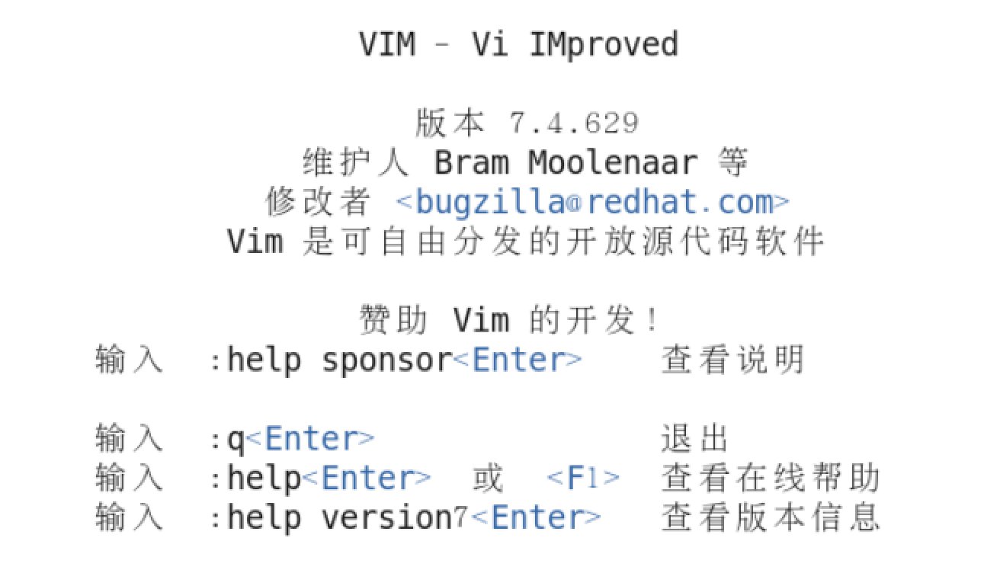
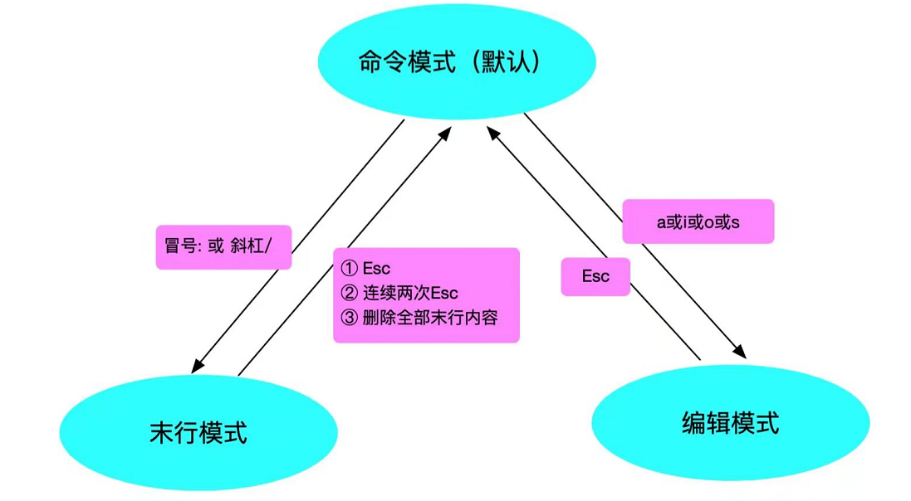
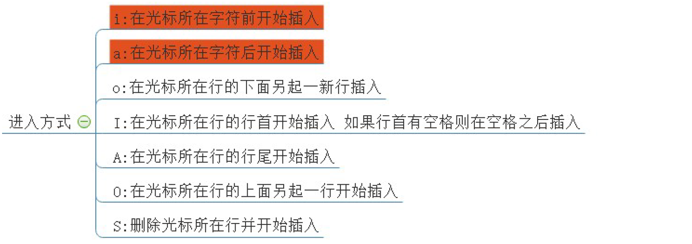
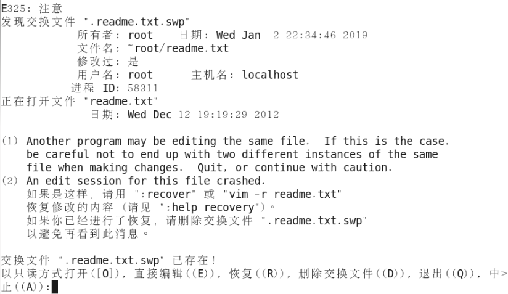

# 编辑器之神—vim编辑器

# 学习目标

1、了解vim编辑器的基本概念

2、了解vi与Vim编辑器之间的关系

3、了解Vim编辑器的三种模式（命令模式、编辑模式、末行模式）

4、掌握命令模式下的相关指令

5、掌握末行模式下的相关指令

6、了解末行模式扩展概念

7、了解Vim编辑器的几个实用功能

# 一、Vim编辑器概述（了解）

## 1、vi编辑器

​	vi（visual editor）编辑器通常被简称为vi，它是Linux和Unix系统上最基本的文本编辑器，类似于Windows 系统下的notepad（记事本）编辑器。学会它后，我们将在Linux 的世界里畅行无阻。

## 2、vi与Vim编辑器

Vim是vi编辑器的加强版，比vi更容易使用。vi的命令几乎全部都可以在vim上使用。

## 3、Vim编辑器学习重点

Vim 重点是==光标的移动，模式切换，删除，查找，替换，复制，粘贴，撤销等==命令的使用。

命令：# vim（GitHub同性交友）

效果如下图所示：



# 二、Vim编辑器的三种模式（重点）

## 1、三种模式

Vim 中存在三种模式（大众的认知）：==命令模式、编辑模式（输入/插入模式）、末行模式（尾行模式）==

```powershell
① 命令模式：在该模式下是不能对文件直接编辑，可以输入快捷键（命令）进行一些操作（复制、粘贴、删除等等）
注意：当我们使用Vim编辑器，打开某个文件后默认进入的模式就是命令模式
② 编辑模式：在该模式下可以对文件的内容进行编辑
③ 末行模式：可以在末行输入命令来对文件进行操作（搜索、替换、保存、退出、撤销、高亮等等）
```

## 2、三种模式之间的关系： vim



## 3、Vim打开文件的四种方式

Vim 的打开文件的方式（4 种，要求掌握的就前三种）：

\# `vim  文件路径`  作用：打开指定的文件，如果文件不存在，自动创建该文件


\# ` vim  +数字  文件的路径`  作用：打开指定的文件，并且将光标移动到指定行


\# ` vim  +/关键词  文件的路径`  作用：打开指定的文件，并且高亮显示关键词


\# ` vim  文件路径1  文件路径2  文件路径3…`  作用：同时打开多个文件


> 注：退出方式，在命令模式下，输入":q"按下回车即可。

:next代表切换到下一个文件

:prev代表切换到上一个文件

补充：在后期使用的Linux 系统中，有些系统分支可能没有自带vim编辑器，而自带了vi，那么vim命令是不能直接使用的，需要先安装，在网络环境下，直接使用`yum install vim`即可。

# 三、命令模式（重点）

## 1、进入命令模式

当我们使用vim命令打开文件时，默认进入的就是命令模式。

那命令模式有哪些作用？我们能使用命令模式做什么呢？

## 2、光标移动

### ☆ 光标移动到行首与行尾（重点）

光标移动到行首，按键：`shift + 6 或 ^`（T 字母上面的6，不要按小键盘的6）

光标移动到行尾，按键：`shift + 4 或 $`（R 字母的左上角的4，不是小键盘的4）

光标移动到首行的行首，按键：`gg`

光标移动到末行的行首，按键：`G [Capslk 再加 G 键] / [Shift + G 键]`

### ☆ 翻屏（了解）

向上    翻屏，按键：`ctrl + b （before） 或 PgUp`

向下    翻屏，按键：`ctrl + f （after）  或 PgDn`

向上翻半屏，按键：`ctrl + u （up）`

向下翻半屏，按键：`ctrl + d （down）`

### ☆ 向上/下/左/右移动指定的行/列（了解）

数字  + 方向键（上下左右），比如5 + 向上方向键，代表将光标向上移动5行

### ☆ 快速定位到指定行（重点）

数字 + G  ， 277G

### ☆ 以当前行为准向上/下移动指定行（了解）

数字+/-【等价于数字】

5 - ：代表向上移动5行

5 +（shift + = ) ：代表向下移动5行

## 3、复制

==① 复制光标所在行==

按键：yy

粘贴：在想要粘贴的地方按下p 键【将粘贴在光标所在行的下一行】,如果想粘贴在光标所在行之前，则使用P键


==② 以光标所在行为准（包含当前行），向下复制指定的行数==

按键：数字yy，如5yy


③ 可视化模式下复制（了解）

按键：ctrl + v（可视块）或V（可视行）或v（可视），然后按下↑  ↓  ←  →方向键来选中需要

复制的区块，按下y 键进行复制（不要按下yy），最后按下p 键粘贴

退出可视模式按下Esc

## 4、剪切/删除

==① 剪切/删除光标所在行==

按键：dd （删除之后下一行上移）

注意：dd 严格意义上说是剪切命令，但是如果剪切了不粘贴就是删除的效果。


==② 剪切/删除光标所在行为准（包含当前行），向下删除/剪切指定的行==

按键：数字dd （删除之后下一行上移）


③ 剪切/删除光标所在的当前行（光标所在位置）之后的内容，但是删除之后下一行不上移

按键：D （删除之后当前行会变成空白行）


④ 可视化删除（了解）

按键：ctrl + v（可视块）或V（可视行）或v（可视），上下左右移动，按下D 表示删除选中行，d 表示删选中块

退出可视模式按下Esc

## 5、撤销/恢复

撤销：u（undo），类似Windows中的ctrl + z

恢复：ctrl + r 恢复（取消）之前的撤销操作【重做，redo】，类似Windows中的ctrl + y

# 四、末行模式（重点）

## 1、进入末行模式

==进入方式：由命令模式进入，按下`:`或者`/`（表示查找）即可进入末行模式==

退出方式：

① 按下Esc键

② 连按 2 次Esc键

③ 删除末行全部输入字符

那末行模式有哪些作用？我们能使用末行模式做什么呢？

## 2、末行模式相关功能

### ① 保存操作（write）

输入：`:w`  保存文件

输入：`:w 路径` 另存为


### ② 退出（quit）

输入：`:q` 退出文件

默认情况下，退出的时候需要对已经进行修改的文件进行保存`:w`，然后才能退出


### ③ 保存并退出

输入：`:wq` 保存并且退出


### ④ 强制（!）

输入：`:q!` 表示强制退出，刚才做的修改操作不做保存

> 备注：以后我们在更改系统配置文件时，其可能会产生以上问题。这个时候就可以使用！强制保存或退出。

### ⑤ 调用外部命令（了解）

输入：`:!外部命令` 【外部指令写法与在正常终端中执行一样】


### ⑥ 搜索/查找（重点）

输入：`/关键词`，再按下回车 【按下/也是进入末行模式的方式之一】

在搜索结果中切换上/下一个结果：N/n （大写N代表上一个结果，小写n代表next）

如果需要取消高亮，则需要在末行模式中输入：`:noh`【no highlight】


### ⑦ 替换（重点）

`:s/搜索的关键词/新的内容` 			替换==光标所在行==的第一处符合条件的内容(只替换1次)

`:s/搜索的关键词/新的内容/g` 		替换==光标所在行==的全部符合条件的内容

`:%s/搜索的关键词/新的内容` 			替换整个文档中每行第一个符合条件的内容

`:%s/搜索的关键词/新的内容/g`		替换整个文档的符合条件的内容

> 注：%表示整个文件，g 表示全局（global）

示例代码：将/root/install.log文件中的*mysql*关键词全部替换成*mariadb*

```:ballot_box_with_check:
:%s/mysql/mariadb/g
```


### ⑧ 显示行号

输入：`:set nu`，nu代表number

如果想取消显示，则输入：`:set nonu`

## 3、末行模式扩展功能（了解）

### ① 同时打开多个文件

`:files`，示例代码：


```powershell
在%a的位置有 2 种显示可能：
%a：a=active，表示当前正在打开的文件
# ：表示上一个打开的文件
```


### ② 切换文件

方式一：如果需要指定切换文件的名称，则可以输入：`:open 已经打开的文件名`


==方式二：可以通过其他命令来切换上一个文件/下一个文件==

输入：`:bp`切换到上一个文件（back prev） 

输入：`:bn`切换到下一个文件（back next）

> 注：除了使用:bp或:bn切换文件，我们还可以使用==:prev或:next==切换上一个文件或下一个文件


### ==③ 多行复制、剪切、删除（重点）==

末行模式下的多行复制、剪切、删除操作

复制语法：`:开始行号,结束行号y`，例如输入`:1,10y`

剪切删除语法：`:开始行号,结束行号d`，例如输入`:1,10d`


扩展：

==一步到位的复制语法：`:开始行号,结束行号 co 粘贴到的行号`==

==剪切粘贴一步到位语法：`:开始行号,结束行号 m 粘贴到的行号`==

### ④ 末行模式下的快速移动

==按键：输入英文`:数字`，按下回车==

### ⑤ set list（了解）

把制表符Tab键显示为^I ，用$标示行尾（使用list分辨尾部的字符是tab还是空格）


### ⑥ set paste与set nopaste（了解）

为什么要使用paste模式？

问题：在终端Vim中粘贴代码时，发现插入的代码会有多余的缩进，而且会逐行累加。原因是终端把粘贴的文本存入键盘缓存（Keyboard Buffer）中，Vim则把这些内容作为用户的键盘输入来处理。导致在遇到换行符的时候，如果Vim开启了自动缩进，就会默认的把上一行缩进插入到下一行的开头，最终使代码变乱。

在粘贴数据之前，输入下面命令开启paste模式
:set paste

粘贴完毕后，输入下面命令关闭paste模式
:set nopaste

### ⑦ 快速调整

:行号 ， :277

# 五、编辑模式



重点看前2 个进入方式：i（insert）、a（after）。

退出方式：按下Esc 键

# 六、实用功能

## 1、代码着色

之前说过vim 是vi 的升级版本，其中比较典型的区别就是vim 更加适合coding，因为vim比vi 多一个代码着色的功能，这个功能主要是为程序员提供编程语言升的语法显示效果，如下：


在实际应用中，我们如何控制着色显示与否？

> syntax：语法，临时调整

开启显示：`:syntax on`

关闭显示：`:syntax off`

## 2、vim计算器

当在编辑文件的时候突然需要使用计算器去计算一些公式，则此时需要用计算器，但是需要退出。

我们如何能不退出vim编辑器，实现简易计算呢？

答：vim 自身集成了一个简易的计算器。

① 进入编辑模式

②  按下按键`ctrl + R 键`，然后输入`=`，此时光标会变到最后一行

③ 输入需要计算的内容，按下回车


## 3、vim的配置（重点）

Vim是一款编辑器，编辑器也是有配置文件的。

Vim配置有三种情况：

​	☆ 在文件打开的时候在末行模式下输出的配置（临时的）

​	==☆ 个人配置文件（~/.vimrc，如果没有可以自行新建）==   set nu

​	☆ 全局配置文件（==vim自带，/etc/vimrc==）				        set nonu

vim启动 =>==加载/etc/vimrc== =>==加载~/.vimrc文件==（vim加载的顺序）

① 新建好个人配置文件之后进入编辑

```shell
# touch ~/.vimrc
```

② 在配置文件中进行配置

```shell
set nu
syntax on
```

配置好之后vim 打开文件就会永远显示行号。

==问题：如果某个配置项，在个人配置文件与全局配置文件产生冲突的时候应该以谁为准？==


测试步骤：在两个配置文件中针对同一个配置项设置不同的值

①先在全局的配置中设置不显示行号，在个人的配置文件中设置显示行号，观察结果

最后显示行号：==说明以个人为准==

②先在全局中配置显示行号，在个人中设置不显示行号，观察结果

最后的显示是不显示行号，==说明以个人为准==

==结论：如果针对同一个配置项，个人配置文件中存在，则以个人配置文件为准，如果个人配置文件中不存在这一项，则以全局配置文件为准。（个人>全局）==

## 4、异常退出

什么是异常退出：在编辑文件之后并没有正常的去wq（保存退出），而是遇到突然关闭终端或者断电的情况，则会显示下面的效果，这个情况称之为异常退出：



==解决办法：将交换文件（在编程过程中产生的临时文件）删除掉即可【在上述提示界面按下D 键，或者使用rm 指令删除交换文件】==


## 5、别名机制

作用：相当于创建一些属于自己的自定义命令

例如：在windows下有cls 命令，在Linux下可能因为没有这个命令而不习惯清屏。现在可以通过别名机制来解决这个问题，可以自己创造出cls命令。

==别名机制依靠一个别名映射文件：~/.bashrc==


效果如下所示：


> 注意：如果想新创造的命令生效，必须要重新登录当前用户或编译bashrc文件

```powershell
命令：重启/su  切换用户 （switch user）
语法：su [用户名] 不写用户名表示切换到root用户

编译bashrc文件（推荐）
语法：source ~/.bashrc
```

==提示：起的别名，一定不要是本身已经被系统支持的命令。==

课堂练习：要求给root 用户创建一个指令 “cc”，实现运行“cc”指令之后统计出当前“/”下有多少个文档（包含隐藏文档）。


运行结果：


## 6、退出方式

回顾：在vim中，退出正在编辑的文件可以使用`:q`或者`:wq`

除了上面的这个语法之外，vim 还支持另外一个保存退出(针对内容)方法`:x`

说明：

① `:x`在文件没有修改的情况下，表示直接退出（等价于:q），在文件修改的情况下表

示保存并退出（:wq）

② 如果文件没有被修改，但是使用wq 进行退出的话，则文件的修改时间会被更新；但是如果文件没有被修改，使用x 进行退出的话，则文件修改时间不会被更新的；主要是会混淆用户对文件的修改时间的认定。

因此建议以后使用`:x`来进行对文件的保存退出。

> 但是：不要使用X，不要使用X，不要使用X，X 表示对文件进行加密操作。

# 七、作业

1、编辑/etc/httpd/conf/httpd.conf的文件，完成以下内容

要求：

① 复制一份到/root家目录，然后更改/root/httpd.conf

② 在277行添加一行代码ServerName localhost:80

③ 替换文件中的路径/var/www/html为/usr/local/www

2、使用别名机制，创建出一个快捷命令"kj"，要求实现按下"kj"回车之后能够实现：统计出Apache 的服务进程数量。