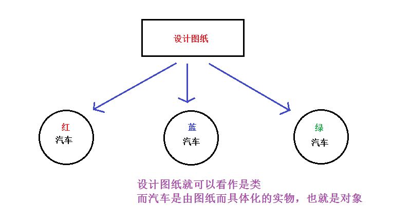
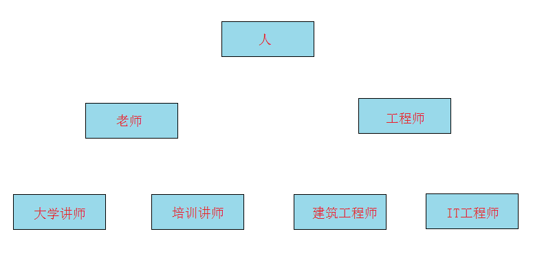
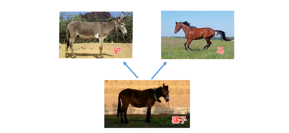

#Python基础学习

> **学习目标内容**
>
> 5. **能够描述面向对象的三大特性**
> 6. **能够理解类与对象**
> 7. **能够设置对象属性**
> 8. **能够添加类方法**
> 9. **能够区分类变量与实例变量**
> 10. **能够理解继承的作用**

#十七、异常处理(了解)

异常处理:
Python程序运行语法出错会有异常抛出
不处理异常会导致程序终止

| 异常种类          | 描述                   |
| ----------------- | ---------------------- |
| IndentationError  | 缩进对齐代码块出现问题 |
| NameError         | 自定义标识符找不到     |
| IndexError        | 下标错误               |
| KeyError          | 键名出错               |
| AssertionError    | 断言异常               |
| SyntaxError       | 语法错误               |
| AttributeError    | 找不到属性             |
| TypeError         | 类型错误               |
| KeyboardInterrupt | ctrl + c 被按下        |
| ImportError       | 导入模块出错           |
| ......            |                        |

**示例: 异常处理的简单应用**

~~~powershell
num = input("请输入一个整数:")
	
try:
    num = int(num)
except ValueError:
    print("你输的不是整数!")
    exit()

print(num)
~~~

> **try语句**
>
> 1. 首先,执行try子句（在关键字try和关键字except之间的语句）。
> 2. 如果没有异常发生，忽略except子句，try子句执行后结束。
> 3. 如果在执行try子句的过程中发生了异常，那么try子句余下的部分将被忽略。
> 4. 如果异常的类型和 except 之后的名称相符，那么对应的except子句将被执行。最后执行 try 语句之后的代码。
> 5. 如果一个异常没有与任何的except匹配，那么这个异常将会报错并终止程序。
>

**示例:**

~~~python
list1 = [1,2,3]

try:
    print(list1[3])			# 这是一个IndexError
except TypeError as err:	# 这里没有捕捉对错误类型
    print("error1",err)
except SyntaxError as err:	# 这里没有捕捉对错误类型
    print("error2:",err)
except Exception as err:	# Exception代表所有错误异常
    print("error3",err)
~~~

# 十八、面向对象编程

## 类与对象

**==类==**与**==对象==**是面向对象两个非常重要的概念。

**类是总结事物特征的抽象概念,是创建对象的模板。对象是按照类来具体化的实物。**

### 类的构成

**类的名称**: 类名

**类的属性**: 一组参数数据

**类的方法**: 操作的方式或行为

如: 为人设计一个类:

名称 : people

属性: name,sex,age,weight,height等

方法: eat,drink,walk,run等

### 类的创建

~~~python
# class People(object): 新式类    class People(): 经典类

class People(object): 	 # 类名python建议使用大驼峰命名(每一个单词的首字母都采用大写字母);				   
	pass
~~~

### 创建对象（类的实例化)

~~~python
class People(object):
    pass

p1 = People()  		# 创建第一个对象p1，这个过程也叫类的实例化
p2 = People()		# 创建第二个对象p2，这个过程也叫类的实例化

print(p1)
print(p2)
print(People())	# 得到的内存地址都不同,也就是说类和类的实例都是生成的内存对象(类和不同的实例占不同的内存地址)

print(id(p1))
print(id(p2))
print(id(People()))	# 用id函数来看也不同
~~~

### 给对象加上属性

比较下面两段代码的传参方式:

~~~python
class People(object):
    pass

p1 = People()
p2 = People()

p1.name = "zhangsan"  	# 给实例p1赋于属性name和值zhangsan
p1.sex = "man"	    	# 给实例p1赋于属性sex和值man

p2.name = "lisi"			# 给实例p2赋于属性name和值lisi
p2.sex = "woman"			# 给实例p2赋于属性sex和值woman

print(p1.name, p1.sex)
print(p2.name, p2.sex)	# 可以打印出赋值的数据
~~~

~~~python
class People(object):

    def __init__(self, name, sex):  # 第一个参数一定是self,代表实例本身.其它要传的参数与函数传参一样(可以传位置参数,关键字参数,默认参数,不定长参数等);__init__为构造函数
        self.name = name		      # 此变量赋给了实例,也就是实例变量
        self.sex = sex

        
p1 = People("zhangsan", "man")		  # 实例化的时候直接传参数
p2 = People("lisi", "woman")

print(p1.name, p1.sex)
print(p2.name, p2.sex)			  # 也可以打印出传入的值
~~~

### 给类加上方法

比较上面代码和下面这段代码

~~~python
class People(object):

    def __init__(self, name, sex):
        self.name = name
        self.sex = sex

    def info(self):					# 定义类的方法,就是一个封装的函数
        print(self.name, self.sex)	# 此方法就是打印对象的name和sex

p1 = People("zhangsan", "man")
p2 = People("lisi", "woman")

p1.info()
p2.info()							# 对象调用类的方法
~~~

### 类的变量

> 类的变量是做什么用的？

先来看几个例子：

**示例:类变量可以被类调用，也可以被实例调用**

~~~python
class People(object):
    abc = "haha"			# 类变量

    def __init__(self, name, sex):
        self.name = name	# 实例变量
        self.sex = sex

    def info(self):
        print(self.name, self.sex)

p1 = People("zhangsan", "man")

print(People.abc)		# 可以看到可以打印类变量的值(值为haha)
print(p1.abc)			# 也可以打印实例化后的类变量的值(值为haha)
~~~

**示例: 类变量与实例变量同名时，实例变量优先于类变量（就好像后赋值的会覆盖前面赋值的)**

~~~python
class People(object):
    name = "haha"			# 类变量与实例变量同名

    def __init__(self, name, sex):
        self.name = name	# 实例变量
        self.sex = sex

    def info(self):
        print(self.name, self.sex)

p1 = People("zhangsan", "man")
p2 = People("lisi", "woman")

print(People.name)		# 结果为haha
print(p1.name)			# 结果为zhangsan。说明变量重名时,实例变量优先于类变量
~~~

**示例: 类变量,实例1,实例2都是独立的内存空间，修改互不影响**

~~~python
class People(object):
    abc = "haha"			# 类变量

    def __init__(self, name, sex):
        self.name = name
        self.sex = sex

    def info(self):
        print(self.name, self.sex)

p1 = People("zhangsan", "man")
p2 = People("lisi", "woman")

p1.abc = "hehe"			# 对p1实例的类变量赋值hehe
print(p1.abc)			# 结果为赋值后hehe
print(p2.abc)			# 结果仍为haha,说明p1的修改不影响p2
print(People.abc)		# 结果仍为haha,说明p1的修改是在p1的内存地址里改的,也不影响类变量本身
~~~

**示例: 类变量的作用就是类似一个通用属性，放在类变量比放在构造函数里效率高**

~~~python
class People(object):
    country = "china"

    def __init__(self, name, sex):
        self.name = name
        self.sex = sex
#		self.country = country	# 如果要实例100个人，都是中国人。下面实例化时每个实例都要传参。

    def info(self):
        print(self.name, self.sex)

p1 = People("zhangsan", "man")
p2 = People("lisi", "woman")	# 如果要实例100个人，都是中国人。放在类变量里实例化就不用写了。

print(p1.name, p1.sex, p1.country)
print(p2.name, p2.sex, p2.country)

p2.country = "USA"			# 如果某一个人要移民，直接改这个属性就行，不影响其它实例。
print(p2.name, p2.sex, p2.country)
~~~

~~~powershell
# 通过默认值参数实现和类变量相似的效果

class People(object):

    def __init__(self, name, sex, country="中国"):
        self.name = name                # 实例变量
        self.sex = sex
        self.country = country
        
    def info(self):
        print(self.name, self.sex, self.country)
        
        
p1 = People("张三", "男", "美国")
p2 = People("李四", "女")

p1.info()
p2.info()
~~~

**小结:**

1. 类变量是对所有实例都生效的，对类变量的增，删，改也对所有实例生效（前提是不要和实例变量同名冲突，同名冲突的情况下，实例变量优先）
2. 类和各个实例之间都是有独立的内存地址，在实例里（增，删，改）只对本实例生效，不影响其它的实例。

更简单点就是：

类似运维里一些配置文件的配置原理（类相当于全局配置，实例相当于是子配置文件或模块配置文件）

### \_\_str\_\_与\_\_del_\_\_(了解)

~~~python
class Hero(object):

    def __init__(self, name):
        self.name = name

    def __str__(self):		# print(对象)会输出__str__函数的返回值
        return "我叫{},我为自己代言".format(self.name)

    def __del__(self):		# 对象调用完销毁时,会调用此函数
        print("......我{}还会回来的......".format(self.name))

hero1 = Hero("亚瑟")
hero2 = Hero("后羿")

print(hero1)
print(hero2)		

# del hero1
# del hero2			# 把这两句del注释分别打开，会有不同的效果

print("="*30)
~~~

**小结:**

| 方法                   | 描述                                                         |
| ---------------------- | ------------------------------------------------------------ |
| def \_\_init\_\_(self) | 创建对象的时候自动调用此方法                                 |
| def \_\_str_\_(self)   | print(对象)时调用此方法                                      |
| def \_\_del_\_(self)   | 对象被销毁的时候自动调用该方法,做一些收尾工作，如关闭打开的文件，释放变量等 |

### 私有属性与私有方法(拓展)

一般情况下，私有的属性、方法都是不对外公布的，往往用来做内部的事情，起到安全的作用。

python没有像其它语言那样有public,private等关键词来修饰，而是在变量前加__来实现私有。

**示例:**

~~~python
class People(object):

    __country = "china"		# 前面加上__，那么就做成了私有属性，就不能被类的外部直接调用

    def __init__(self, name, sex):
        self.name = name
        self.__sex = sex		# 前面加上__，那么就做成了私有属性，就不能被类的外部直接调用

    def __info(self):		# 前面加上__，那么就做成了私有方法，就不能被类的外部直接调用
        print(self.name, self.sex)

p1 = People("zhangsan", "man")
# print(p1.sex)		
# print(p1.__sex)		
# print(p1.country)
# print(p1.__country)		
# p1.info()
# p1.__info()					# 这六句单独打开注释验证，都会报错。不能调用私有属性和私有方法
~~~

**示例: 如果类的外部需要调用到私有属性的值，可以对私有属性单独定义一个类的方法，让实例通过调用此方法来调用私有属性(私有方法同理)**

~~~python
class People(object):

    __country = "china"

    def __init__(self, name, sex):
        self.name = name
        self.__sex = sex		
        
    def __info(self):
        print(self.name, self.__sex)

    def show_sex(self):
        print(self.__sex)

    def show_country(self):
        print(self.__country)

    def show_info(self):
        People.__info(self)

p1 = People("zhangsan", "man")

p1.show_sex()
p1.show_country()
p1.show_info()		
~~~

## 继承

### 继承介绍

> 什么是继承？

~~~python
class  人
	吃
	喝	
	玩
	拉
	睡
class 老师
	上课
    备课
class 工程师
	上班
    加班
~~~

**继承的作用**: ==**减少代码的冗余,便于功能的升级（原有的功能进行完善）与扩展（原没有的功能进行添加）**==

**示例:**

~~~python
class People(object):
    def __init__(self, name, age):
        self.name = name
        self.age = age

    def eat(self):
        print("come to eat,{}".format(self.name))

    def drink(self):
        print("come to drink,{}".format(self.name))

class Man(People):			# 表示Man类继承父类（基类，超类）People
    pass

class Woman(People):		# 表示Woman类继承父类（基类，超类）People
    pass

m1 = Man("zhangsan", 16)
m1.eat()					# 继承了父类，就可以调用父类的方法
m1.drink()					# 继承了父类，就可以调用父类的方法

w1 = Woman("lisi", 18)
w1.eat()					# 继承了父类，就可以调用父类的方法
w1.drink()					# 继承了父类，就可以调用父类的方法
~~~

### 方法重写

**示例: 在子类里重写父类的方法**

~~~python
class People(object):
    def __init__(self, name, age):
        self.name = name
        self.age = age

    def eat(self):
        print("come to eat,{}".format(self.name))

    def drink(self):
        print("come to drink,{}".format(self.name))

class Man(People):
    def drink(self):		# 在子类里写了一个和父类相同的方法，那么对这个子类实例化，调用此方法，子类方法会优先生效（方法重写）
#        People.drink(self)	# 可以在子类里继续调用父类的方法
        if self.age >= 18:	# 下面这是可以在原来的基础上再增加额外的功能代码
            print("you can drink!")
        else:
            print("you can not drink!")

class Woman(People):
    pass

m1 = Man("zhangsan", 16)
m1.drink()
~~~

### 子类重新构造属性

**示例:在子类重新构造属性**

~~~python
class People(object):
    def __init__(self, name, age):
        self.name = name
        self.age = age

    def eat(self):
        print("come to eat,{}".format(self.name))

    def drink(self):
        print("come to drink,{}".format(self.name))

class Man(People):
    def drink(self):
#        People.drink(self)
        if self.age >= 18:
            print("you can drink!")
        else:
            print("you can not drink!")

class Woman(People):
    def __init__(self, name, age, bra_size):		# 如果我的子类有新属性，需要在这里用构造函数重新构造，但需要和原父类的属性对应
        People.__init__(self, name, age)		# 经典类写法；换成super(Woman, self).__init__(name, age)这句也一样（新式类写法）
        self.bra_size = bra_size

w1 = Woman("lisi", 18, "D")
w1.eat()
~~~

### 多层继承(了解)

**示例: 多层继承例一**

~~~python
class Grandfather(object):

    def house(self):				# 爷爷类的方法
        print("a big house!")

class Father(Grandfather):			# 爸爸类继承爷爷类

    def car(self):
        print("a cool car!")

class child(Father):				# 孩子类继承爸爸类
    pass

p1 = child()							# 实例化一个孩子
p1.house()							# 这个孩子对象可以调用爷爷的方法
~~~

**示例: 多层继承例二**

~~~python
class People(object):
    def __init__(self, name, sex):
        self.name = name
        self.sex = sex

class Love(People):
    def fall_in_love(self, obj):
        if self.sex == "男":
            print("{}向{}求婚".format(self.name, obj.name))
        elif self.sex == "女":
            print("{}要给{}生猴子".format(self.name, obj.name))
        else:
            print("性别输入有误")

class Man(Love):
    pass
class Woman(Love):
    pass

m1 = Man("张三", "男")
w1 = Woman("李四", "女")

m1.fall_in_love(w1)
w1.fall_in_love(m1)
~~~

### 多重继承(了解)

支持面向对象编程的开发语言中，支持多重继承的语言并不多，像java,php这些都只支持单继承。支持多重继承的主要就是python,c++。

> 什么是多重继承？
>
> 答: 多重继承，即子类有多个父类(可以多于两个)，并且具有它们的特征。

**示例: 多重继承例一**

~~~python
class Father(object):

    def sing(self):
        print("can sing")

class Mother(object):

    def dance(self):
        print("can dance")

class child(Father, Mother):			# 继承Father,Mother两个父类
    pass

p1 = child()
p1.sing()							# 可以用Father的方法
p1.dance()							# 也可以用Mother的方法
~~~

**示例: 多重继承例二**

~~~python
class People(object):
    def __init__(self, name, sex):
        self.name = name
        self.sex = sex

class Love(object):
    def fall_in_love(self,obj):
        if self.sex == "男":				# 这里的sex变量在Love类里并没有定义
            print("{}向{}求婚".format(self.name, obj.name))
        elif self.sex == "女":
            print("{}要给{}生猴子".format(self.name, obj.name))
        else:
            print("性别输入有误")
            
class Man(People, Love):			# Love里没有sex变量,People里有sex变量,多继承合到一起就OK
    pass

class Woman(People, Love):
    pass

m1 = Man("张三", "男")
w1 = Woman("李四", "女")

m1.fall_in_love(w1)
w1.fall_in_love(m1)
~~~

## 多态(了解)

多态: 一类事物的有多种形态。如水蒸汽，水，冰。

回顾下我们前面讲过: Python是强类型的**==动态==**解释型语言,这里的动态其实就是多态。 

python是变量本身是没有类型的，变量的类型是由赋的值所决定的。值是int，变量就是int; 值是str，变量类型就是str。这其实就是一种多态。

python崇尚鸭子类型(ducking type):  鸭子类型是动态类型的一种风格。"当看到一只鸟走起来像鸭子、游泳起来像鸭子、叫起来也像鸭子，那么这只鸟就可以被称为鸭子。" 在鸭子类型中，关注的不是对象的类型本身，而是它是如何使用的。

作用: 接口统一  方便调用

**示例:**

~~~python
class Animal(object):
   def jiao(self):
        pass

class Dog(Animal):
    def jiao(self):
        print("wang wang...")

class Cat(Animal):
    def jiao(self):
        print("miao miao...")

d1 = Dog()
c1 = Cat()

d1.jiao()		# 实例接类的方法来调用，结果是狗叫
c1.jiao()		# 实例接类的方法来调用，结果为猫叫
~~~

**示例:**

~~~python
class Animal(object):
   def jiao(self):
        pass

class Dog(Animal):
    def jiao(self):
        print("wang wang...")

class Cat(Animal):
    def jiao(self):
        print("miao miao...")

def jiao(obj):
     obj.jiao()

d1 = Dog()
c1 = Cat()

jiao(d1)		# 调用方式统一
jiao(c1)		# 调用方式统一
~~~

# 综合题目

示例: 下例把paramiko的远程执行命令，上传，下载功能简单地做成了面向对象编程的方法。请解决相关bug或按此思路扩展写其它程序

~~~python
import paramiko,sys

class Host(object):

	port = 22   

    def __init__(self, ip, port, username, password):
        self.ip = ip
        self.port = port
        self.username = username
        self.password = password

    def exec_cmd(self):
        ssh = paramiko.SSHClient()
        ssh.set_missing_host_key_policy(paramiko.AutoAddPolicy)
        ssh.connect(hostname=self.ip, port=self.port, username=self.username, password=self.password)
        input_cmd = input("input your command: ")
        stdin, stdout, stderr = ssh.exec_command(input_cmd)
        cor_res = stdout.read()
        err_res = stderr.read()
        print(cor_res.decode())
        print(err_res.decode())
        ssh.close()

    def get_or_put(self):
        trans = paramiko.Transport((self.ip, int(self.port)))
        trans.connect(username=self.username, password=self.password)
        sftp = paramiko.SFTPClient.from_transport(trans)
        if choice == 2:
            get_remote_file = input("下载文件的路径: ")
            get_local_file = input("下载到本地的路径: ")
            sftp.get(get_remote_file,get_local_file)
        else:
            put_local_file = input("要上传的本地文件路径: ")
            put_remote_path = input("上传到远程的路径: ")
            sftp.put(put_local_file,put_remote_path)

print("菜单")
print("1-exec")
print("2-get")
print("3-put")
print("0-quit")

host1 = Host(sys.argv[1], sys.argv[2], sys.argv[3], sys.argv[4])

choice=int(input("your choice: "))
if choice == 1:
    host1.exec_cmd()
elif choice == 2 or choice == 3:
    host1.get_or_put()
elif choice == 0:
    exit(1)

    
# python3.6 脚本名  10.1.1.12 22 root 123456
~~~