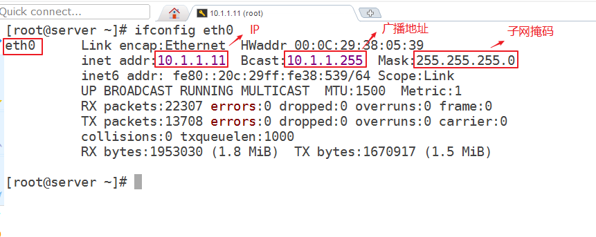

# Linux shell编程五

# 课程目标

- [ ] 掌握常用的正则表达式元字符含义

- [ ] 掌握sed的删除行操作

- [ ] 掌握sed的打印行操作

- [ ] 掌握sed的增加行操作

- [ ] 掌握sed的修改替换操作


# 一、正则表达式

## 正则表达式介绍

**正则表达式**（Regular Expression、regex或regexp，缩写为RE），也译为正规表示法、常规表示法，是一种字符模式，用于在查找过程中匹配指定的字符。

几乎所有开发语言都支持正则表达式，后面学习的python语言里也有正则表达式.

linux里主要支持正则表达式的命令有**grep**, **sed**, **awk**

## 正则一

| 表达式 | 说明                                                 | 示例                        |
| ------ | ---------------------------------------------------- | --------------------------- |
| []     | 括号里的字符任选其一                                 | [abc]\[0-9]\[a-z]           |
| [^]    | 不匹配括号里的任意字符(括号里面的^号为"非",不是开头) | [^abc]表示不是a,不是b,不是c |
| ^[]    | 以括号里的任意单个字符开头(这里的^是开头的意思)      | ^[abc]:以a或b或c开头        |
| ^[^]   | 不以括号里的任意单个字符开头                         |                             |
| ^      | 行的开头                                             | ^root                       |
| $      | 行的结尾                                             | bash$                       |
| ^$     | 空行                                                 |                             |

**示例: 准备一个文件**

~~~powershell
# vim 1.txt
boot
boat
rat
rot
root
Root
brot.
~~~

~~~powershell
查找有rat或rot字符的行
# grep r[oa]t 1.txt						
rat
rot
brot.
~~~

~~~powershell
查看非r字符开头，但2-4个字符为oot的行
# grep ^[^r]oot 1.txt
boot
Root
~~~

~~~powershell
查找有非大写字母与一个o字符连接的行
# grep '[^A-Z]o' 1.txt
boot
boat
rot
root				
Root			# 这个也可以查出来，因为第2-3个字符符合要求
brot.
~~~

~~~powershell
查找不以r和b开头的行
# grep ^[^rb] 1.txt
Root
~~~

~~~powershell
查找以rot开头以rot结尾的行(也就是这一行只有rot三个字符)
# grep ^rot$ 1.txt
rot
~~~


~~~powershell
查找.号结尾的字符，需要转义并引号引起来(比较特殊，因为下面就要讲到.号是特殊的元字符)
# grep "\."$  1.txt
brot.
~~~

问题: 使用grep输出`/etc/vsftpd/vsftpd.conf`配置文件里的配置(去掉注释与空行)

~~~powershell
提示: grep -v取反
别忘了grep -E扩展模式可以实现或
如: grep -E "root|ftp" /etc/passwd

# yum install vsftpd -y


# grep -v ^# /etc/vsftpd/vsftpd.conf |grep -v ^$
# grep -v '^#|^$' /etc/vsftpd/vsftpd.conf
~~~

问题: 使用grep输出`/etc/samba/smb.conf`配置文件里的配置(去掉注释与空行)

~~~powershell
# yum install samba -y

# grep -v -E '#|^;|^$' /etc/samba/smb.conf |grep [a-z]
注:
samba配置文件是个比较奇葩的配置文件，在不同版本格式都有所不同，所以不同版本会有不同的答案。请灵活对待
~~~


**grep加上关键字颜色显示**（centos7默认就有颜色)

~~~powershell
在/etc/bashrc最后的空白处追加一句
# vim /etc/bashrc
alias grep='grep --color=auto'

# source /etc/bashrc
~~~


## 正则二			

| 表达式                                         | 功能                             |
| ---------------------------------------------- | -------------------------------- |
| [[:alnum:]]                                    | 大小写字母与数字                 |
| [[:alpha:]]                                    | 字母字符(包括大小写字母)         |
| [[:blank:]]                                    | 空格与制表符                     |
| **[[:digit:]]或[0-9]**          (**==常用==**) | 数字                             |
| **[[:lower:]]或[a-z]**        (**==常用==**)   | 小写字母                         |
| **[[:upper:]]或[A-Z] **      (**==常用==**)    | 大写字母                         |
| [[:punct:]]                                    | 标点符号                         |
| [[:space:]]                                    | 包括换行符，回车等在内的所有空白 |

~~~powershell
查找不以大写字母开头的行
# grep '^[^[:upper:]]' 1.txt 			# 这个取反的写法很特殊,^符在两个中括号中间(了解即可)
# grep  '^[^A-Z]' 1.txt 
# grep -v '^[A-Z]' 1.txt 
~~~

~~~powershell
查找有数字的行
# grep '[0-9]' 1.txt
# grep [[:digit:]] 1.txt
~~~

~~~powershell
查找一个数字和一个字母连起来的行
# grep -E '[0-9][a-Z]|[a-Z][0-9]' grep.txt 			# grep -E是扩展模式，中间|符号代表"或者"
~~~


**问题:** 请问汉语描述`grep [^a-z] 1.txt`是查找什么?

~~~powershell
查找不全部是小写字母的行
~~~

**示例:** 输入一个字符，判断输入的是大写字母还是小写字母还是数字，还是其它

~~~powershell
方法一:
#!/bin/bash

read -n 1 -p "input a char:" char			# -n 1代表输入1个字符后就自动回车了
echo										# echo代表换行

case "$char" in							# 使用case语句对$char进程多分支判断
	[[:upper:]] )						# 正则表达式匹配大写字母，(注意:这里用[A-Z]匹配不了)
		echo "大写字母"
		;;
	[[:lower:]] )						# 正则表达式匹配小写字母，(注意:这里用[a-z]匹配不了)
		echo "小写字母"
		;;
	[[:digit:]] )						# 正则表达式匹配数字
		echo "数字"
		;;
	* )
		echo "其它"
esac
~~~


~~~powershell
方法二:
#!/bin/bash

read -n 1 -p "input a char:" char			# -n 1代表输入1个字符后就自动回车了
echo										# echo代表换行

# 使用if多分支进行判断
if [[ $char =~ [A-Z] ]];then			# [[ ]]两个中括号里写判断条件，里面使用=~匹配正则表达式
	echo "大写字母"
elif [[ $char =~ [a-z] ]];then
	echo "小写字母"
elif [[ $char =~ [0-9] ]];then
	echo "数字"
else
	echo "其它"
fi
~~~

**练习:** read -s输入一个密码, 判断此密码复杂度.(长度大于等于8位，并且有大小写字母和数字三类字符)

~~~powershell

~~~


## 正则三

名词解释：

**元字符**: 指那些在正则表达式中具有**特殊意义的专用字符**, 如:点(.) 星(*) 问号(?)等 

**前导字符**：即位于元字符前面的字符		ab**==c==***   aoo**==o==.**

**==注意:==** 元字符如果想表达字符本身需要转义，如.号就想匹配"."号本身则需要使用\\.

| 字符  | 字符说明                                                     | 示例           |
| ----- | ------------------------------------------------------------ | -------------- |
| *     | 前导字符出现0次或者连续多次                                  | ab*  abbbb     |
| .     | 除了换行符以外，任意单个字符                                 | ab.   ab8 abu  |
| .*    | 任意长度的字符                                               | ab.*  abdfdfdf |
| {n}   | 前导字符连续出现n次             （**需要配合grep -E或egrep使用**) | [0-9]{3}       |
| {n,}  | 前导字符至少出现n次             （**需要配合grep -E或egrep使用**) | [a-z]{4,}      |
| {n,m} | 前导字符连续出现n到m次      （**需要配合grep -E或egrep使用**) | o{2,4}         |
| +     | 前导字符出现1次或者多次    （**需要配合grep -E或egrep使用**) | [0-9]+         |
| ?     | 前导字符出现0次或者1次      （**需要配合grep -E或egrep使用**) | go?            |
| ( )   | 组字符                                                       |                |

示例文本:

~~~powershell
# vim 2.txt
ggle
gogle
google
gooogle
gagle
gaagle
gaaagle
abcgef
abcdef
goagle
aagoog
wrqsg
~~~

问题:一起来看看下面能查出哪些字符,通过结果理解记忆

~~~powershell
# grep g.  2.txt
# grep g*  2.txt  				# 结果比较怪
# grep g.g 2.txt
# grep g*g 2.txt
# grep go.g 2.txt
# grep go*g 2.txt
# grep go.*g 2.txt
# grep -E go{2}g 2.txt
# grep -E 'go{1,2}g' 2.txt		# 需要引号引起来，单引双引都可以
# grep -E 'go{1,}g' 2.txt		# 需要引号引起来，单引双引都可以
# grep -E go+g 2.txt
# grep -E go?g 2.txt
~~~


**示例:** 查出eth0网卡的IP,广播地址,子网掩码



~~~powershell
# ifconfig eth0 | grep -E -o '([0-9]{1,3}\.){3}[0-9]{1,3}'
10.1.1.11
10.1.1.255
255.255.255.0
解析:
[0-9]{1,3}\.  	   代表3个数字接一个.号
([0-9]{1,3}\.){3}  前面用小括号做成一个组，后面{3}代表重重复3次
[0-9]{1,3}		   最后一个数字后不需要.号
~~~


**示例:** 匹配邮箱地址

~~~powershell
# echo "daniel@126.com" | grep -E '^[0-9a-zA-Z]+@[a-z0-9]+\.[a-z]+$'
解析:
^[0-9a-zA-Z]+@      	代表@符号前面有1个或多个字符开头(大小写字母或数字)
@[a-z0-9]+\.[a-z]+$	 	代表@符号和.号(注意.号要转义)中间有1个或多个字符(小写字母或数字)
						.号后面有1个或多个字符(小写字母)结尾
~~~


**perl内置正则(拓展)**

Perl内置正则(需要使用grep -P来匹配),这种匹配方式在python也有。但不建议都记住，上面所学的就完全够用了.

~~~powershell
\d      匹配数字  [0-9]
\w      匹配字母数字下划线[a-zA-Z0-9_]
\s      匹配空格、制表符、换页符[\t\r\n]
~~~


# 二、sed

## 2.1 sed介绍

~~~powershell
# man sed
sed  - stream editor for filtering and trans-forming text
~~~

Windows下的编辑器:


linux下的编辑器:

* **==vi或vim==**
* gedit
* emacs等


- 首先sed把当前正在处理的行保存在一个临时缓存区中（也称为模式空间），然后处理临时缓冲区中的行，完成后把该行发送到屏幕上。
- sed把每一行都存在临时缓冲区中，对这个**副本**进行编辑，所以不会修改原文件。当然你也可以选择修改源文件，需要`sed -i 操作的文件`

学习sed的关键是要搞清楚,它是一个**流**==编辑器==,编辑器常见的功能有: 

* 删除**行**
* 打印**行**
* 增加**行**
* 替换(修改)

~~~powershell
sed参数
-e	进行多项编辑，即对输入行应用多条sed命令时使用
-n	取消默认的输出
-r  使用扩展正则表达式
-i inplace，原地编辑（修改源文件）

sed操作
d  删除行
p  打印行
a  后面加行
i  前面加行
s  替换修改
~~~

## 2.2 删除行操作

**==d(delete)代表删除==**

### 使用数字匹配行

指定删除第2行

~~~powershell
# head  -5 /etc/passwd |cat -n |sed  2d

变量引用需要双引号
a=2					
# head -5 /etc/passwd |cat -n |sed "$a"d	
~~~

删除第2行到第3行，中间的逗号表示范围

~~~powershell
# head -5 /etc/passwd |cat -n |sed  2,3d
~~~

删除第1行和第5行，中间为分号，表示单独的操作

~~~powershell
错误，需要引号引起来
# head -5 /etc/passwd |cat -n |sed 1d;5d
正确
# head -5 /etc/passwd |cat -n |sed '1d;5d'
~~~

删除第1,2,4行, -e参数是把不同的多种操作可以衔接起来

```powershell
head -5 /etc/passwd |cat -n |sed -e '2d;4d' -e '1d'
```


问题:下面操作代表什么

~~~powershell
# head -n 5 /etc/passwd |cat -n |sed  '1d;3d;5d'

# head -n 5 /etc/passwd |cat -n |sed  '1,3d;5d'
~~~

### 使用正则匹配行

如果不知道行号,但知道行里的某个单词或相关字符,我们可以使用正则表达式进行匹配

删除匹配oo的行

~~~powershell
# head -n 5 /etc/passwd |cat -n | sed  '/oo/d'
~~~

删除以root开头的行

~~~powershell
# head -n 5 /etc/passwd |sed '/^root/d'
~~~

删除以bash结尾的行

~~~powershell
# head -n 5 /etc/passwd |sed '/bash$/d'
~~~

其它任意正则表达式都可以匹配

**练习:(注意: -i参数会直接操作源文件,所以请先不加-i测试，测试OK后再加-i参数)**

`sed -i`删除/etc/vsftpd/vsftpd.conf里所有的注释和空行

~~~powershell
# sed -i '/^#/d;/^$/d' /etc/vsftpd/vsftpd.conf
~~~

`sed -i`删除/etc/samba/smb.conf里所有的注释和空行

~~~powershell
# sed -i '/#/d;/;/d;/^$/d;/^\t$/d' /etc/samba/smb.conf
~~~


## 2.3 打印行操作

打印行(删除的反义)

**==p(print)代表打印==**

### 使用数字匹配行

打印第1行

~~~powershell
# head  -5 /etc/passwd |cat -n | sed  1p
     1  root:x:0:0:root:/root:/bin/bash				# 会在原来5行的基础上再打印第1行
     1  root:x:0:0:root:/root:/bin/bash
     2  bin:x:1:1:bin:/bin:/sbin/nologin
     3  daemon:x:2:2:daemon:/sbin:/sbin/nologin
     4  adm:x:3:4:adm:/var/adm:/sbin/nologin
     5  lp:x:4:7:lp:/var/spool/lpd:/sbin/nologin

# head  -5 /etc/passwd |cat -n | sed -n 1p			# 正确做法加一个-n参数
     1  root:x:0:0:root:/root:/bin/bash
~~~

打印第1行和第4行

~~~powershell
# head  -5 /etc/passwd |sed -ne '1p;4p'
~~~

打印1-4行

~~~powershell
# head  -5 /etc/passwd |sed -ne '1,4p'
~~~

### 使用正则匹配行

打印有root关键字的行

~~~powershell
# head -5 /etc/passwd |sed -n '/root/p'
~~~

打印以root开头的行

~~~powershell
# head -5 /etc/passwd |sed -n '/^root/p'
~~~

找出var/log/secure日志里成功登录的ssh信息

~~~powershell
方法1:
# sed -n '/Accepted/p' /var/log/secure
方法2:
# grep Accepted /var/log/secure
方法3:(awk还没学，先了解一下)
# awk '$0~"Accepted" {print $0}' /var/log/secure
~~~


## 2.4 增加行操作

**==a(append)代表后面加行==**

**==i(insert)代表前面插入行==**

准备一个文件

~~~powershell
# cat 1.txt
11111
22222
44444
55555
~~~

在第2行后加上33333这一行

~~~powershell
# sed -i '2a33333' 1.txt
# cat 1.txt
11111
22222
33333
44444
55555
~~~

在第1行插入00000这一行

~~~powershell
# sed -i '1i00000' 1.txt
# cat 1.txt
00000
11111
22222
33333
44444
55555
~~~

也可以用**正则**匹配行,这里表示在4开头的行的后一行加上ccccc这一行

~~~powershell
# sed -i '/^4/accccc' 1.txt	

# cat 1.txt
00000
11111
22222
33333
44444
ccccc
55555
~~~

## 2.5 修改替换操作

**sed的修改替换格式与vi里的修改替换格式一样**

### 使用数字匹配行

替换每行里的第1个匹配字符

~~~powershell
# head  -5 /etc/passwd |sed 's/:/===/'
root===x:0:0:root:/root:/bin/bash
bin===x:1:1:bin:/bin:/sbin/nologin
daemon===x:2:2:daemon:/sbin:/sbin/nologin
adm===x:3:4:adm:/var/adm:/sbin/nologin
lp===x:4:7:lp:/var/spool/lpd:/sbin/nologin
~~~

全替换

~~~powershell
# head  -5 /etc/passwd |sed 's/:/===/g'
root===x===0===0===root===/root===/bin/bash
bin===x===1===1===bin===/bin===/sbin/nologin
daemon===x===2===2===daemon===/sbin===/sbin/nologin
adm===x===3===4===adm===/var/adm===/sbin/nologin
lp===x===4===7===lp===/var/spool/lpd===/sbin/nologin
~~~

替换2-4行

~~~powershell
# head  -5 /etc/passwd |sed '2,4s/:/===/g'
root:x:0:0:root:/root:/bin/bash
bin===x===1===1===bin===/bin===/sbin/nologin
daemon===x===2===2===daemon===/sbin===/sbin/nologin
adm===x===3===4===adm===/var/adm===/sbin/nologin
lp:x:4:7:lp:/var/spool/lpd:/sbin/nologin
~~~

替换2行和4行

~~~powershell
# head  -5 /etc/passwd |sed '2s/:/===/g;4s/:/===/g'
root:x:0:0:root:/root:/bin/bash
bin===x===1===1===bin===/bin===/sbin/nologin
daemon:x:2:2:daemon:/sbin:/sbin/nologin
adm===x===3===4===adm===/var/adm===/sbin/nologin
lp:x:4:7:lp:/var/spool/lpd:/sbin/nologin
~~~

替换第2行的第1个和第3个匹配字符

~~~powershell
注意后面的数字是2，前面替换了1个，剩下的里面替换第2个也就是原来的第3个
# head  -5 /etc/passwd |sed '2s/:/===/;2s/:/===/2'
root:x:0:0:root:/root:/bin/bash
bin===x:1===1:bin:/bin:/sbin/nologin
daemon:x:2:2:daemon:/sbin:/sbin/nologin
adm:x:3:4:adm:/var/adm:/sbin/nologin
lp:x:4:7:lp:/var/spool/lpd:/sbin/nologin
~~~

### 使用正则匹配行

替换以daemon开头的那一行

~~~powershell
# head -5 /etc/passwd |sed '/^daemon/s/:/===/g'
root:x:0:0:root:/root:/bin/bash
bin:x:1:1:bin:/bin:/sbin/nologin
daemon===x===2===2===daemon===/sbin===/sbin/nologin
adm:x:3:4:adm:/var/adm:/sbin/nologin
lp:x:4:7:lp:/var/spool/lpd:/sbin/nologin
~~~


**&符号在sed替换里代表前面被替换的字符**

~~~powershell
理解下面两句的不同:
s/[0-9]/ &/
s/[0-9]/ [0-9]/
~~~


练习: 使用脚本实现修改主机名(假设改为a.b.com)

~~~powershell
# hostname a.b.com
# sed -i '/HOSTNAME=/s/server.cluster.com/a.b.com/' /etc/sysconfig/network
# echo "10.1.1.11 a.b.com" >> /etc/hosts
~~~

练习: 修改/etc/selinx/config配置文件,将selinux关闭

~~~powershell
# sed -i '/SELINUX=/s/enforcing/disabled/' /etc/selinux/config
~~~

## sed分域操作(拓展)

将()之间的字符串(**==一般为正则表达式==**)定义为组,并且将匹配这个表达式的保存到一个区域（一个正则表达式最多可以保存9个）,它们使用\1到\9来表示。然后进行替换操作

**注意:** sed分域操作的格式就是替换修改.

**示例:** 把`hello,world.sed`变成`world,sed.hello`(注意: 1个逗号1个点号)

~~~powershell
方法1:
# echo "hello,world.sed" | sed 's/\(.*\),\(.*\)\.\(.*\)/\2,\3.\1/'
world,sed.hello
此方法\符太多了，建议使用-r扩展模式，就不用加\转义括号了

方法2:
# echo "hello,world.sed" | sed -r 's/(.*),(.*)\.(.*)/\2,\3.\1/'
world,sed.hello

方法3:
# echo "hello,world.sed" | sed -r 's/(.....)(.)(.....)(.)(...)/\3\2\5\4\1/'
world,sed.hello

方法4:
# echo "hello,world.sed" | sed -r 's/(.{5})(.)(.{5})(.)(.{3})/\3\2\5\4\1/'
world,sed.hello
~~~


**示例:** 以/etc/passwd文件前5行为例,进行如下处理

删除每行的第一个字符

~~~powershell
# head -5 /etc/passwd |cut -c2-
# head -5 /etc/passwd |sed -r 's/(.)(.*)/\2/'
# head -5 /etc/passwd |sed -r 's/.//1'
# head -5 /etc/passwd |sed -r 's/^.//'
~~~

删除每行的第九个字符

~~~powershell
# head -5 /etc/passwd |cut -c1-8,10-
# head -5 /etc/passwd |sed -r 's/(.{8})(.)(.*)/\1\3/'
# head -5 /etc/passwd |sed -r 's/.//9'
~~~

删除倒数第5个字符

~~~powershell
# head -5 /etc/passwd |rev |cut -c1-4,6- |rev
# head -5 /etc/passwd |sed -r 's/(.*)(.)(....)/\1\3/'
~~~

把每行的第5个字符和第8个字符互换，并删除第10个字符

~~~powershell
# head -5 /etc/passwd | sed -r 's/(....)(.)(..)(.)(.)(.)(.*)/\1\4\3\2\5\7/'
~~~


# **课后练习**

写一个简单初始化系统的脚本

1, 修改主机名（也就是说你获取IP为10.1.1.11,则主机名改成server11.cluster.com)

2, 配置可以使用的本地yum

3, 关闭防火墙与selinux

4, 安装配置vsftpd，不允许匿名用户登录，配置完后启动服务并设置为开机自动启动

5, 可在此基础上继续自由发挥扩展

~~~powershell

~~~


